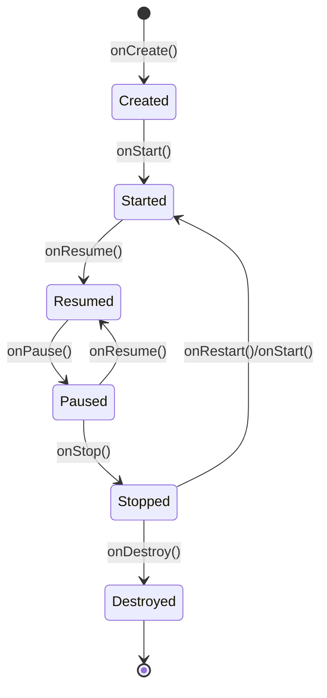
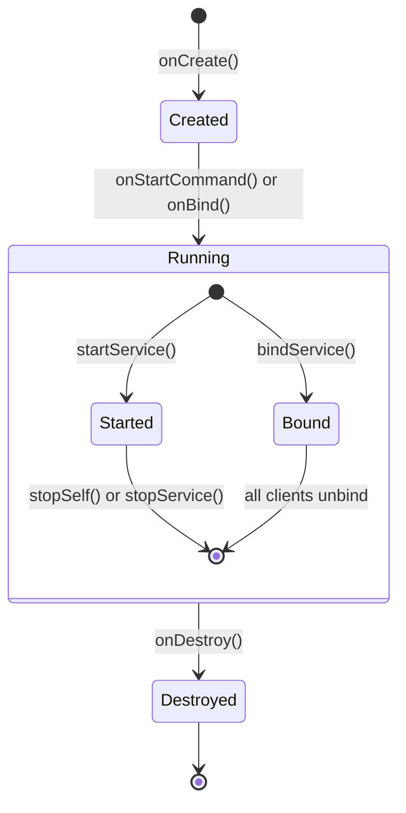
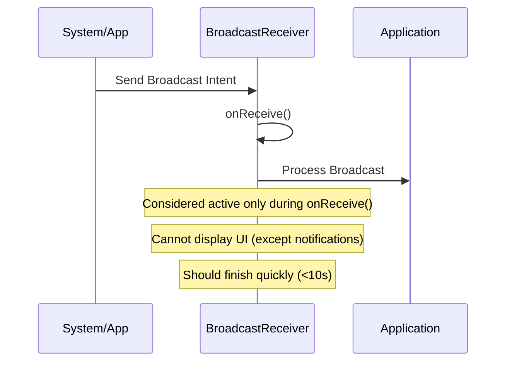
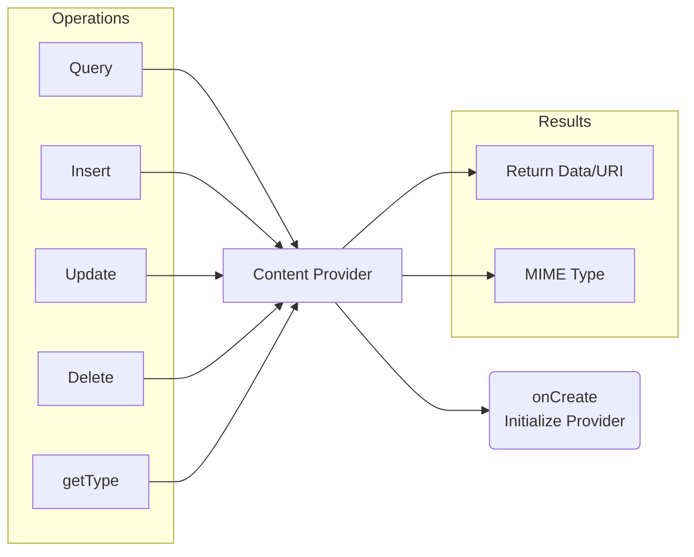
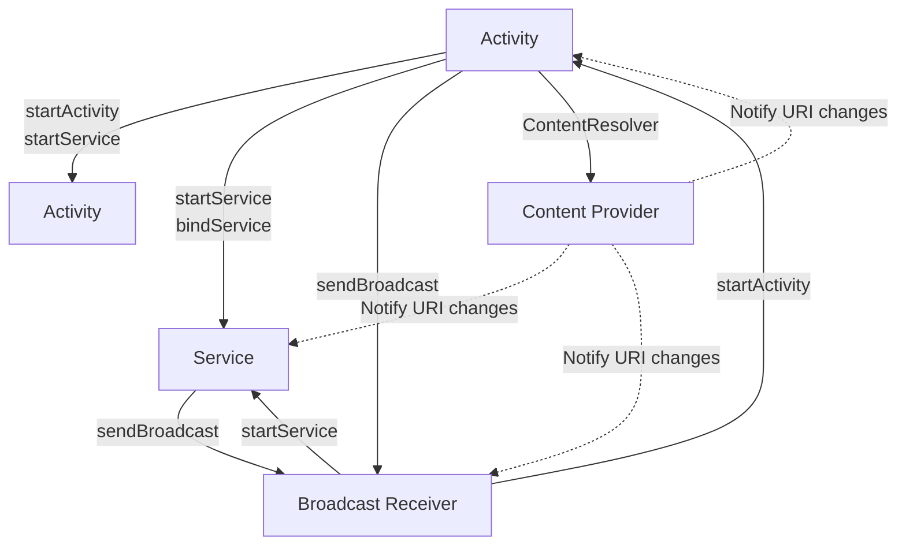

# Android Application Components

Android applications are composed of four fundamental building blocks that define their structure and behavior. This document provides detailed information about each component, their lifecycle, common use cases, and how they interact with each other.

## Table of Contents

- [Activities](#activities)
- [Services](#services)
- [Broadcast Receivers](#broadcast-receivers)
- [Content Providers](#content-providers)
- [Component Comparison](#component-comparison)
- [Component Interactions](#component-interactions)

## Activities

An Activity represents a single screen with a user interface. Activities are the entry point for user interaction with an Android app.

### Activity Lifecycle

The Activity lifecycle consists of several callback methods that allow the system to create, start, resume, pause, stop, and destroy an activity.



### Key Characteristics

- Represents a single screen with a user interface
- Can start other activities within the same or different apps
- Can be part of a back stack allowing navigation between activities
- Has a defined lifecycle controlled by the Android system
- Can be destroyed and recreated during configuration changes

### Common Use Cases

- Displaying user interfaces and forms
- Handling user interactions
- Navigation between app screens
- Starting other components (activities, services)
- Presenting data to users

### Example Implementation

```kotlin
class MainActivity : AppCompatActivity() {
    override fun onCreate(savedInstanceState: Bundle?) {
        super.onCreate(savedInstanceState)
        setContentView(R.layout.activity_main)
        
        // Initialize UI components
    }
    
    override fun onResume() {
        super.onResume()
        // Activity is visible and ready for user interaction
    }
    
    override fun onPause() {
        super.onPause()
        // Activity is partially obscured or about to be hidden
    }
}
```

## Services

A Service is an application component that performs operations in the background without a user interface. Services run independently of activities and can continue running even after the user switches to another application.

### Service Lifecycle



### Types of Services

| Service Type | Description | Creation Method | Termination |
|--------------|-------------|-----------------|-------------|
| Started Service | Initiated by a component calling `startService()`. Runs in the background indefinitely. | `startService()` | `stopSelf()` or `stopService()` |
| Bound Service | Initiated by a component calling `bindService()`. Offers client-server interface for components to interact with the service. | `bindService()` | When all clients unbind |
| Foreground Service | A service that performs operations noticeable to the user, must display a notification. | `startForeground()` | `stopSelf()` or `stopService()` |

### Key Characteristics

- Runs in the background without UI
- Continues running even when the app is in the background
- Has higher priority than inactive or invisible activities
- Should be used for operations that need to continue regardless of UI state
- Must be declared in the AndroidManifest.xml file

### Common Use Cases

- Playing music in the background
- Downloading or uploading files
- Performing network operations
- Processing data
- Executing scheduled tasks

### Example Implementation

```kotlin
class BackgroundService : Service() {
    override fun onBind(intent: Intent): IBinder? {
        return null  // Return binder for bound services
    }
    
    override fun onStartCommand(intent: Intent?, flags: Int, startId: Int): Int {
        // Perform background operations
        
        // Return one of these flags:
        // START_STICKY, START_NOT_STICKY, START_REDELIVER_INTENT
        return START_STICKY
    }
    
    override fun onDestroy() {
        super.onDestroy()
        // Clean up resources
    }
}
```

## Broadcast Receivers

A Broadcast Receiver responds to system-wide broadcast announcements. These broadcasts can originate from the system (e.g., battery low, screen turned off) or applications (custom broadcasts).

### Broadcast Receiver Lifecycle



### Registration Types

| Registration Type | Description | Lifespan | Configuration |
|-------------------|-------------|----------|--------------|
| Static Registration | Declared in AndroidManifest.xml | Always active (even when app is not running) | `<receiver>` element in manifest |
| Dynamic Registration | Registered and unregistered programmatically | Active only while registered | `registerReceiver()` and `unregisterReceiver()` |

### Key Characteristics

- Short-lived components that respond to broadcast intents
- Should complete processing quickly (within 10 seconds)
- Can't display UI but can create notifications
- Used as gateways to other components
- Can be triggered even when the app is not running (static registration)

### Common Use Cases

- Responding to system events (boot completed, connectivity changes)
- Interacting with other applications via broadcasts
- Listening for changes in device state (battery, screen)
- Scheduling alarms and notifications
- Background event handling

### Example Implementation

```kotlin
class NetworkChangeReceiver : BroadcastReceiver() {
    override fun onReceive(context: Context, intent: Intent) {
        if (intent.action == ConnectivityManager.CONNECTIVITY_ACTION) {
            // Check network connectivity status
            val connectivityManager = context.getSystemService(Context.CONNECTIVITY_SERVICE) as ConnectivityManager
            val networkInfo = connectivityManager.activeNetworkInfo
            
            if (networkInfo != null && networkInfo.isConnected) {
                // Handle connected state
            } else {
                // Handle disconnected state
            }
        }
    }
}
```

## Content Providers

A Content Provider manages access to a structured set of data. They encapsulate the data and provide mechanisms for defining data security.

### Content Provider Lifecycle and Operations



### Key Methods

| Method | Description | Return Value |
|--------|-------------|--------------|
| `query()` | Retrieves data | Cursor with rows of data |
| `insert()` | Adds a new record | URI of the inserted item |
| `update()` | Modifies existing records | Number of rows affected |
| `delete()` | Removes records | Number of rows affected |
| `getType()` | Gets MIME type of data | String representing the MIME type |

### Key Characteristics

- Provides structured access to data via a content URI
- Abstracts the underlying data storage implementation
- Allows secure sharing of data between applications
- Supports standard CRUD (Create, Read, Update, Delete) operations
- Uses a SQL-like interface for data manipulation

### Common Use Cases

- Sharing data between applications
- Providing access to structured data within an app
- Exposing data for search functionality
- Implementing sync adapters
- Interacting with system data (contacts, calendar, media)

### Example Implementation

```kotlin
class ProductProvider : ContentProvider() {
    companion object {
        const val AUTHORITY = "com.example.app.provider"
        val CONTENT_URI = Uri.parse("content://$AUTHORITY/products")
    }
    
    private lateinit var dbHelper: DatabaseHelper
    
    override fun onCreate(): Boolean {
        dbHelper = DatabaseHelper(context!!)
        return true
    }
    
    override fun query(uri: Uri, projection: Array<String>?, selection: String?, 
                      selectionArgs: Array<String>?, sortOrder: String?): Cursor? {
        val db = dbHelper.readableDatabase
        return db.query("products", projection, selection, selectionArgs, 
                       null, null, sortOrder)
    }
    
    // Other CRUD operation implementations...
    
    override fun getType(uri: Uri): String {
        return "vnd.android.cursor.dir/vnd.example.products"
    }
}
```

## Component Comparison

| Feature | Activity | Service | Broadcast Receiver | Content Provider |
|---------|----------|---------|-------------------|-----------------|
| UI | Yes | No | No (except notifications) | No |
| Lifespan | Medium (while visible) | Long (background) | Very short (event-based) | As needed (for data access) |
| Entry Point | User interaction | Component calls or system | System/app broadcasts | Data access requests |
| Primary Purpose | User interaction | Background processing | Event handling | Data sharing |
| Can start other components | Yes | Yes | Yes (limited) | No |
| Declared in Manifest | Yes | Yes | Yes (static) or No (dynamic) | Yes |

## Component Interactions

Android components interact with each other primarily through Intents, which are messaging objects used to request an action from components.



### Intent Communication

- **Explicit Intents**: Target a specific component by exact class name
- **Implicit Intents**: Describe an action to perform, allowing the system to find an appropriate component

### Inter-Component Data Sharing

1. **Intent Extras**: Bundle data passed between components
2. **Content Providers**: Structured data access
3. **Shared Preferences**: Simple data persistence
4. **Broadcasts**: System-wide messaging

### Security Considerations

- Components can be public or private (via `android:exported` attribute)
- Intent filters determine which implicit intents a component can receive
- Permissions can restrict access to components
- Content Providers have fine-grained URI permissions

## Conclusion

Android's component-based architecture provides a flexible way to build applications with clear separation of concerns. Understanding how these components work together is crucial for developing robust, efficient, and maintainable Android applications.

Each component serves a specific purpose in the Android ecosystem:
- Activities handle user interaction
- Services perform background operations
- Broadcast Receivers respond to system-wide events
- Content Providers manage and share data

Properly implementing these components according to their intended use cases ensures that applications behave as expected within the Android operating environment and provide a seamless user experience.
