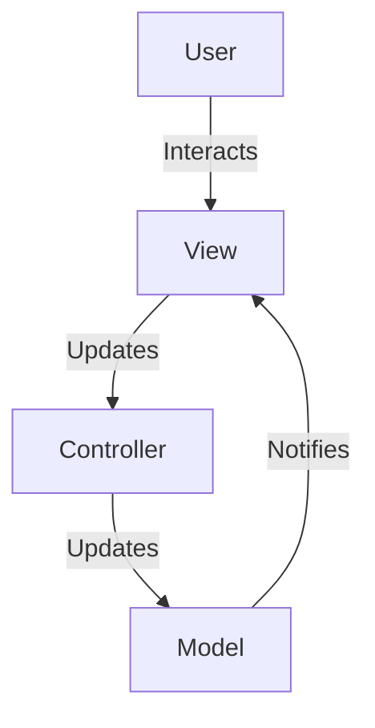
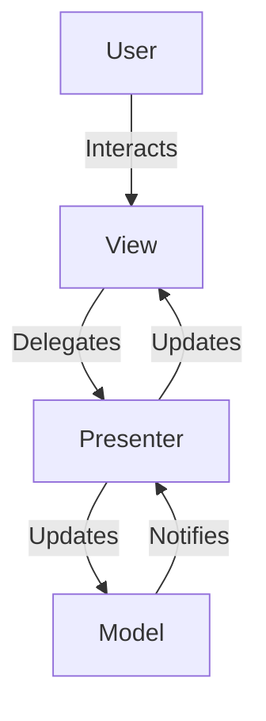
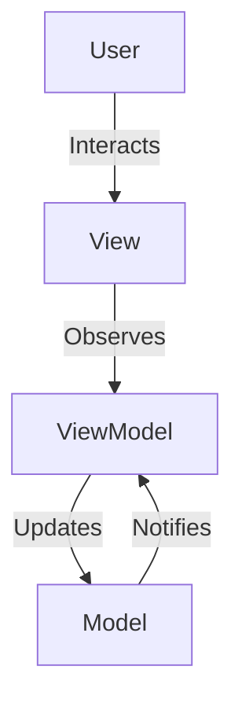
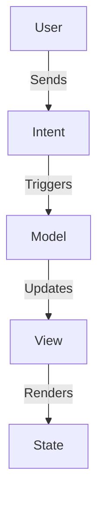

# Android Architecture Models

Android development supports several architecture models to structure code and improve maintainability. Below are some of the most commonly used models:

[link](https://www.google.com/url?sa=i&url=https%3A%2F%2Fmedium.com%2F%40ankit.sinhal%2Fmvc-mvp-and-mvvm-design-pattern-6e169567bbad&psig=AOvVaw3Y1skQ06c3hV8QQ4jKueGu&ust=1745255469977000&source=images&cd=vfe&opi=89978449&ved=0CBQQjRxqFwoTCMijiLeN54wDFQAAAAAdAAAAABAJ)

## 1. Model-View-Controller (MVC)
- **Description**: Separates the application into three components: Model, View, and Controller.
- **Responsibilities**:
  - **View**: Displays the data to the user.
  - **Controller**: Handles user input and updates the Model or View accordingly.
  - **Model**: Manages the data and business logic.
  - **Drawbacks**: Tight coupling between View and Controller can make testing and scaling difficult.

## 2. Model-View-Presenter (MVP)
- **Description**: An evolution of MVC where the Controller is replaced by a Presenter.
- **Responsibilities**:
  - **Model**: Same as in MVC.
  - **View**: Displays data and delegates user interactions to the Presenter.
  - **Presenter**: Acts as a middleman, handling logic and updating the View.
- **Advantages**: Easier to test as the Presenter is decoupled from the View.
- **Drawbacks**: Can lead to a bloated Presenter in complex applications.

## 3. Model-View-ViewModel (MVVM)
- **Description**: Introduces a ViewModel to handle UI-related data and logic.
- **Responsibilities**:
  - **Model**: Same as in MVC and MVP.
  - **View**: Observes the ViewModel and updates the UI automatically.
  - **ViewModel**: Exposes data streams and handles business logic.
- **Advantages**: Simplifies UI updates using data binding or observable patterns.
- **Drawbacks**: Can be complex to implement for beginners.

## 4. Model-View-Intent (MVI)
- **Description**: A reactive architecture pattern focusing on unidirectional data flow.
- **Responsibilities**:
  - **Model**: Represents the state of the application.
  - **View**: Renders the state and sends user intents.
  - **Intent**: Represents user actions or events that trigger state changes.
- **Advantages**: Ensures predictable state management and is well-suited for reactive programming.
- **Drawbacks**: Requires a solid understanding of reactive streams and can be verbose.

## Conclusion
Choosing the right architecture depends on the complexity of the application, team expertise, and project requirements. Each model has its strengths and trade-offs, so understanding them is key to building scalable and maintainable Android applications.
