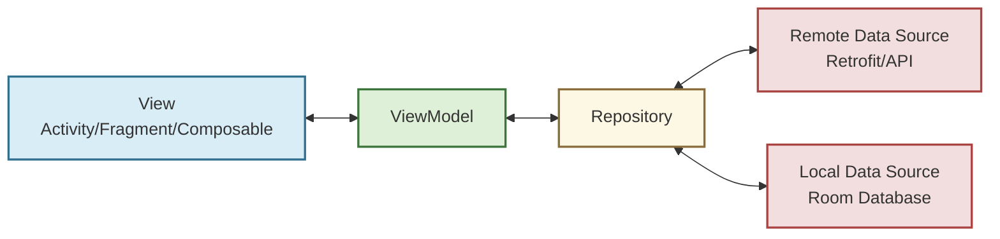
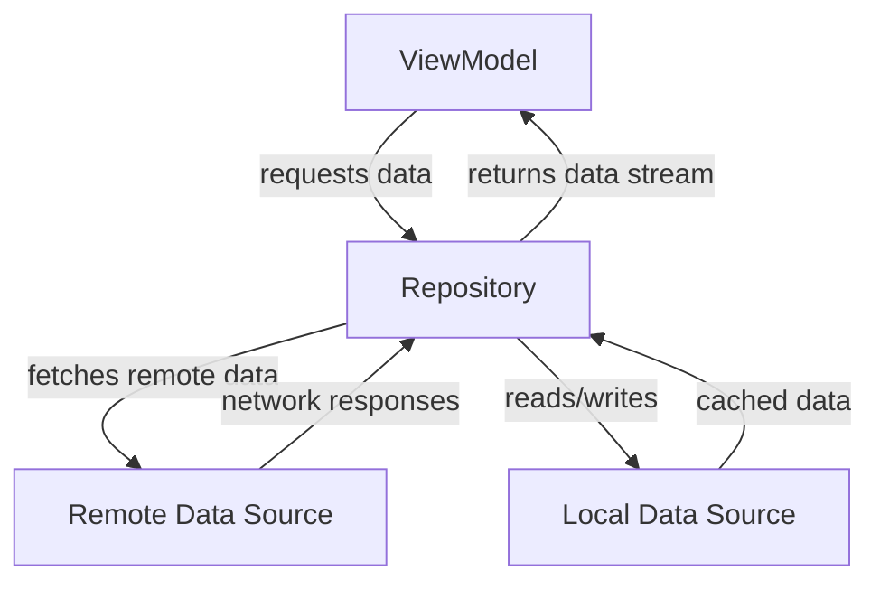
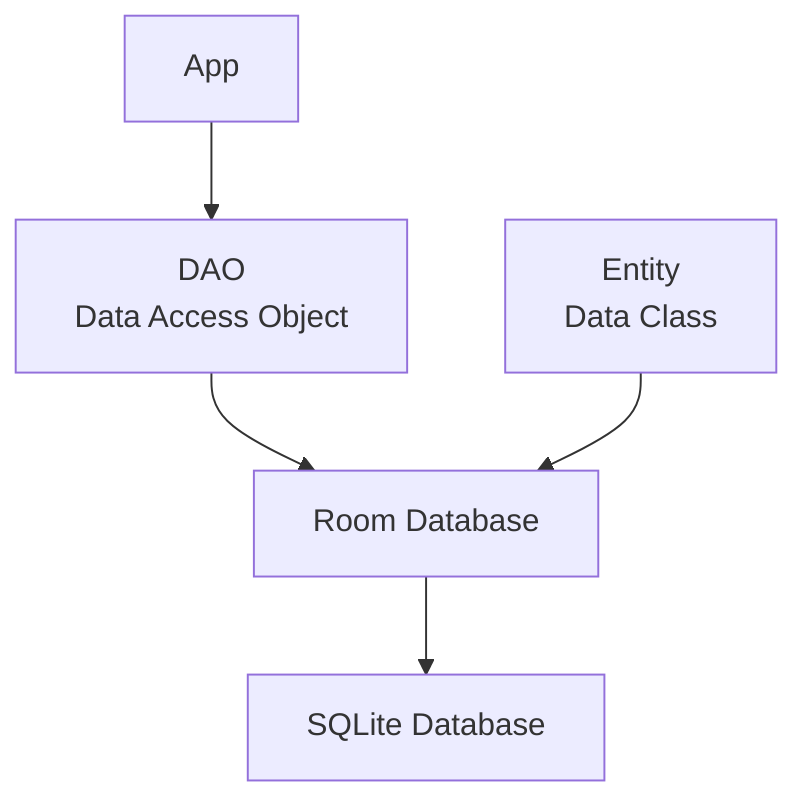
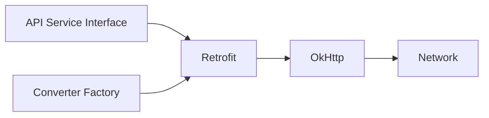
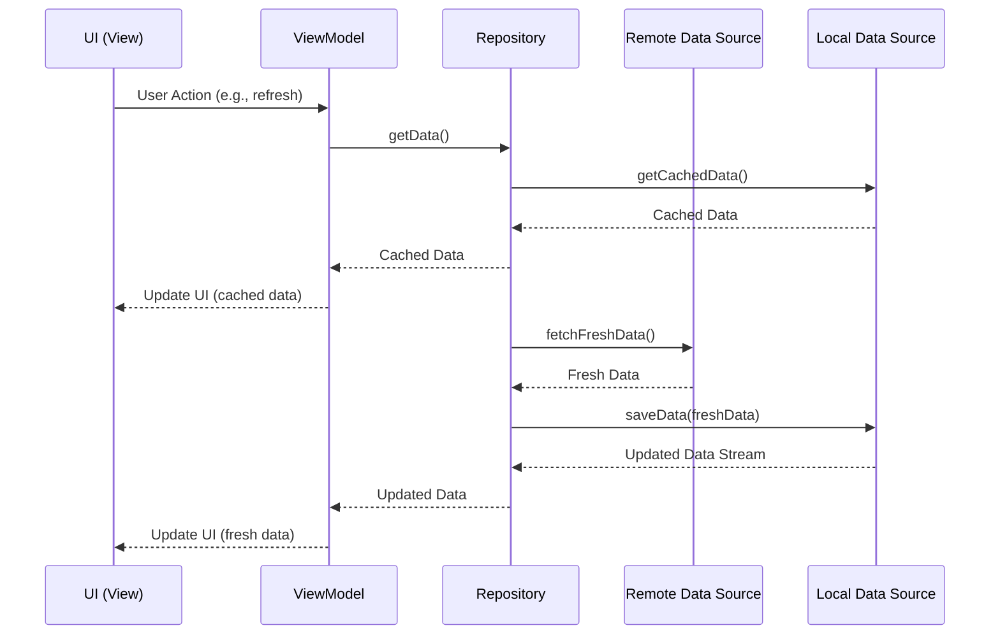

# MVVM Architecture in Android

## What is MVVM?

MVVM (Model-View-ViewModel) is an architectural pattern that separates the development of user interface from business logic and data. It enables a cleaner codebase with better separation of concerns.

## Core Components of MVVM

### View
- UI elements (Activities, Fragments, Composables)
- Observes and reacts to state changes
- Forwards user interactions to ViewModel

### ViewModel
- Exposes data streams to the View
- Handles UI-related business logic
- Survives configuration changes
- Does not reference Views directly

### Model
- Business logic and data sources
- Domain models and data entities
- Repository interfaces

## Complete MVVM Architecture



## Repository Pattern

The Repository pattern provides a clean API for data access to the rest of the application:

- Acts as a mediator between different data sources (network, cache, database)
- Provides a clean API to the ViewModel
- Manages query logic
- Implements business rules for data retrieval and storage



### Implementation Example

```kotlin
class UserRepository(
    private val remoteDataSource: UserRemoteDataSource,
    private val localDataSource: UserLocalDataSource
) {
    // Returns a Flow that will emit every time the database changes
    fun getUsers(): Flow<Result<List<User>>> = flow {
        // Emit loading state
        emit(Result.Loading)
        
        // Always emit cached data first
        localDataSource.getUsers()
            .collect { cachedUsers ->
                emit(Result.Success(cachedUsers))
            }
            
        // Try to fetch fresh data
        try {
            val remoteUsers = remoteDataSource.fetchUsers()
            localDataSource.saveUsers(remoteUsers)
            // No need to emit here as the flow from localDataSource will emit updated data
        } catch (e: Exception) {
            // Emit error, but only if we don't have cached data
            if (localDataSource.getUserCount() == 0) {
                emit(Result.Error(e))
            }
        }
    }.flowOn(Dispatchers.IO)
}

// Result wrapper for UI states
sealed class Result<out T> {
    object Loading : Result<Nothing>()
    data class Success<T>(val data: T) : Result<T>()
    data class Error(val exception: Throwable) : Result<Nothing>()
}
```

## Room Database

Room is an SQLite object mapping library that provides an abstraction layer over SQLite:



### Key Components

1. **Entity**: Defines database table schema
   ```kotlin
   @Entity(tableName = "users")
   data class UserEntity(
       @PrimaryKey val id: String,
       val name: String,
       val email: String,
       val avatarUrl: String,
       val createdAt: Long = System.currentTimeMillis()
   )
   ```

2. **DAO (Data Access Object)**: Provides methods to interact with the database
   ```kotlin
   @Dao
   interface UserDao {
       @Query("SELECT * FROM users ORDER BY createdAt DESC")
       fun observeAll(): Flow<List<UserEntity>>
       
       @Query("SELECT * FROM users WHERE id = :userId")
       suspend fun getUserById(userId: String): UserEntity?
       
       @Insert(onConflict = OnConflictStrategy.REPLACE)
       suspend fun insertAll(users: List<UserEntity>)
       
       @Delete
       suspend fun delete(user: UserEntity)
       
       @Query("DELETE FROM users")
       suspend fun deleteAll()
       
       @Query("SELECT COUNT(*) FROM users")
       suspend fun getUserCount(): Int
   }
   ```

3. **Database**: Ties entities and DAOs together
   ```kotlin
   @Database(
       entities = [UserEntity::class, PostEntity::class],
       version = 1,
       exportSchema = false
   )
   @TypeConverters(DateConverter::class)
   abstract class AppDatabase : RoomDatabase() {
       abstract fun userDao(): UserDao
       abstract fun postDao(): PostDao
       
       companion object {
           private const val DATABASE_NAME = "app-database"
           
           // Example of creating database instance
           fun create(context: Context): AppDatabase {
               return Room.databaseBuilder(
                   context.applicationContext,
                   AppDatabase::class.java,
                   DATABASE_NAME
               ).build()
           }
       }
   }
   ```

## Retrofit

Retrofit is a type-safe HTTP client for Android that simplifies API integration:



### Implementation

1. **Define API Service**
   ```kotlin
   interface ApiService {
       @GET("users")
       suspend fun getUsers(): Response<List<UserDto>>
       
       @GET("users/{userId}")
       suspend fun getUserById(@Path("userId") userId: String): Response<UserDto>
       
       @POST("users")
       suspend fun createUser(@Body user: UserCreateRequest): Response<UserDto>
       
       @DELETE("users/{userId}")
       suspend fun deleteUser(@Path("userId") userId: String): Response<Unit>
   }
   ```

2. **Create Retrofit Instance**
   ```kotlin
   object RetrofitClient {
       private const val BASE_URL = "https://api.example.com/v1/"
       
       // Create OkHttpClient with interceptors for logging, auth, etc
       private val okHttpClient = OkHttpClient.Builder()
           .addInterceptor(HttpLoggingInterceptor().apply {
               level = HttpLoggingInterceptor.Level.BODY
           })
           .addInterceptor { chain ->
               val request = chain.request().newBuilder()
                   .addHeader("Authorization", "Bearer $API_KEY")
                   .build()
               chain.proceed(request)
           }
           .connectTimeout(30, TimeUnit.SECONDS)
           .readTimeout(30, TimeUnit.SECONDS)
           .build()
       
       // Create Retrofit instance with OkHttpClient
       val retrofit: Retrofit = Retrofit.Builder()
           .baseUrl(BASE_URL)
           .client(okHttpClient)
           .addConverterFactory(GsonConverterFactory.create())
           .build()
       
       // Create API Service
       val apiService: ApiService = retrofit.create(ApiService::class.java)
   }
   ```

## Data Flow



## Tying It All Together

### ViewModel Implementation

```kotlin
class UserViewModel(
    private val userRepository: UserRepository
) : ViewModel() {
    
    private val _usersState = MutableStateFlow<UsersState>(UsersState.Loading)
    val usersState: StateFlow<UsersState> = _usersState.asStateFlow()
    
    init {
        fetchUsers()
    }
    
    fun fetchUsers() {
        viewModelScope.launch {
            userRepository.getUsers().collect { result ->
                _usersState.value = when (result) {
                    is Result.Loading -> UsersState.Loading
                    is Result.Success -> UsersState.Success(result.data)
                    is Result.Error -> UsersState.Error(
                        result.exception.message ?: "Unknown error"
                    )
                }
            }
        }
    }
    
    fun refreshUsers() {
        viewModelScope.launch {
            _usersState.value = UsersState.Loading
            userRepository.refreshUsers() // Explicitly fetch from remote
            // The repository flow will emit new values when data changes
        }
    }
}

sealed class UsersState {
    object Loading : UsersState()
    data class Success(val users: List<User>) : UsersState()
    data class Error(val message: String) : UsersState()
}
```

### UI Implementation with Compose

```kotlin
@Composable
fun UserScreen(viewModel: UserViewModel = viewModel()) {
    val usersState by viewModel.usersState.collectAsState()
    
    Scaffold(
        topBar = {
            TopAppBar(
                title = { Text("Users") },
                actions = {
                    IconButton(onClick = { viewModel.refreshUsers() }) {
                        Icon(Icons.Default.Refresh, contentDescription = "Refresh")
                    }
                }
            )
        }
    ) { padding ->
        Box(modifier = Modifier.padding(padding)) {
            when (val state = usersState) {
                is UsersState.Loading -> {
                    CircularProgressIndicator(
                        modifier = Modifier.align(Alignment.Center)
                    )
                }
                is UsersState.Success -> {
                    UserList(users = state.users)
                }
                is UsersState.Error -> {
                    ErrorMessage(
                        message = state.message,
                        onRetry = { viewModel.fetchUsers() }
                    )
                }
            }
        }
    }
}

@Composable
fun UserList(users: List<User>) {
    LazyColumn {
        items(users) { user ->
            UserItem(user = user)
        }
    }
}
```

## Additional Components

### Use Cases / Interactors

Use cases represent specific actions that can be performed in your application:

```kotlin
class GetUsersUseCase(private val userRepository: UserRepository) {
    operator fun invoke(): Flow<Result<List<User>>> {
        return userRepository.getUsers()
    }
}

class RefreshUsersUseCase(private val userRepository: UserRepository) {
    suspend operator fun invoke(): Result<Unit> {
        return try {
            userRepository.refreshUsers()
            Result.Success(Unit)
        } catch (e: Exception) {
            Result.Error(e)
        }
    }
}
```

### Data Mappers

Convert between different data models:

```kotlin
object UserMapper {
    fun entityToDomain(entity: UserEntity): User {
        return User(
            id = entity.id,
            name = entity.name,
            email = entity.email,
            avatarUrl = entity.avatarUrl
        )
    }
    
    fun dtoToEntity(dto: UserDto): UserEntity {
        return UserEntity(
            id = dto.id,
            name = dto.name,
            email = dto.email,
            avatarUrl = dto.avatarUrl ?: ""
        )
    }
    
    fun domainToUi(user: User): UserUiModel {
        return UserUiModel(
            id = user.id,
            displayName = user.name,
            emailAddress = user.email,
            avatarUrl = user.avatarUrl,
            initials = user.name.split(" ").mapNotNull { it.firstOrNull()?.toString() }.take(2).joinToString("")
        )
    }
}
```

## Benefits of MVVM Architecture

- **Separation of Concerns**: Each component has a specific responsibility
- **Testability**: Components can be tested in isolation
- **Maintainability**: Easier to modify and extend
- **Scalability**: Scales well for large applications
- **Lifecycle Awareness**: ViewModel survives configuration changes

## Best Practices

1. Keep ViewModels independent of Android framework
2. Use LiveData/StateFlow for reactive UI updates
3. Implement single source of truth
4. Implement proper error handling
5. Use coroutines for asynchronous operations
6. Use dependency injection for better testability
