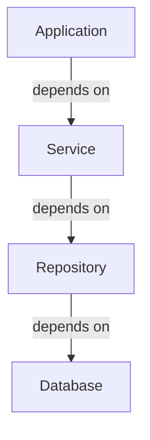
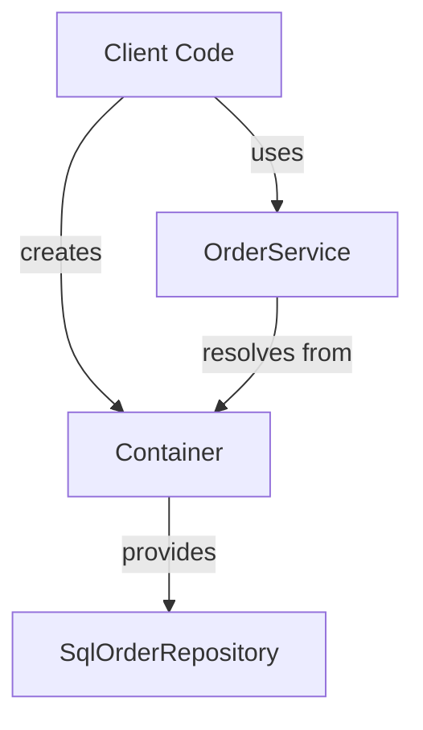
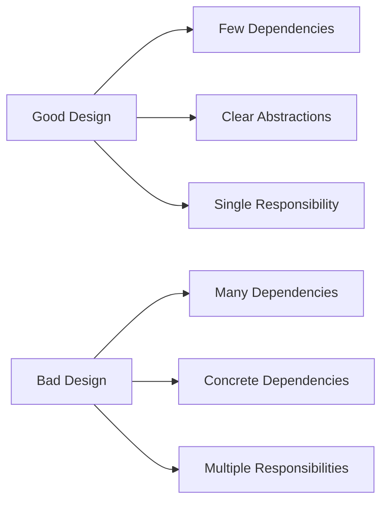
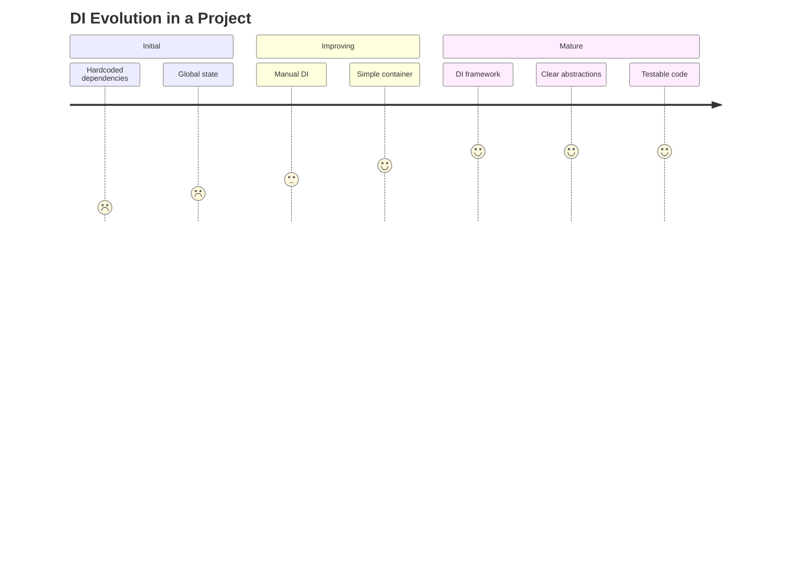

# Dependency Injection: From Basics to Advanced Techniques

## Table of Contents
- [Introduction](#introduction)
- [Basic Dependency Injection Methods](#basic-dependency-injection-methods)
- [Intermediate Techniques](#intermediate-techniques)
- [Advanced Dependency Injection](#advanced-dependency-injection)
- [Android Dependency Injection with Hilt](#android-dependency-injection-with-hilt)
- [Comparison of DI Approaches](#comparison-of-di-approaches)
- [Best Practices and Common Pitfalls](#best-practices-and-common-pitfalls)

## Introduction

### What is Dependency Injection?

**Dependency Injection (DI)** is a design pattern that implements Inversion of Control (IoC) for resolving dependencies. It allows you to "inject" the objects a class needs (its dependencies) rather than having the class create or find those objects itself.



### Why use Dependency Injection?

1. **Loose coupling**: Components depend on abstractions rather than concrete implementations
2. **Testability**: Dependencies can be easily mocked or stubbed for unit testing
3. **Modularity**: Components can be developed, tested, and maintained independently
4. **Flexibility**: Implementations can be swapped without changing dependent code
5. **Lifecycle management**: A DI container can manage object lifetimes

### Core Principles

- **Dependency Inversion Principle**: High-level modules should not depend on low-level modules; both should depend on abstractions
- **Single Responsibility Principle**: A class should have only one reason to change
- **Interface Segregation**: Clients should not be forced to depend on interfaces they don't use

## Basic Dependency Injection Methods

### 1. No Dependency Injection (Anti-pattern)

Let's start by showing code without DI:

```typescript
// Without dependency injection
class OrderService {
  private repository = new SqlOrderRepository(); // Concrete dependency created inside
  
  placeOrder(order: Order): boolean {
    // Use repository to save order
    return this.repository.save(order);
  }
}

// Usage
const orderService = new OrderService();
orderService.placeOrder(new Order());
```

Problems with this approach:
- Tight coupling to `SqlOrderRepository` implementation
- Cannot easily substitute repository implementation
- Difficult to unit test

### 2. Constructor Injection

The most common and recommended form of DI:

```typescript
interface IOrderRepository {
  save(order: Order): boolean;
}

class SqlOrderRepository implements IOrderRepository {
  save(order: Order): boolean {
    // Implementation for SQL database
    return true;
  }
}

class OrderService {
  private repository: IOrderRepository;
  
  constructor(repository: IOrderRepository) {
    this.repository = repository;
  }
  
  placeOrder(order: Order): boolean {
    return this.repository.save(order);
  }
}

// Usage
const repository = new SqlOrderRepository();
const orderService = new OrderService(repository);
orderService.placeOrder(new Order());
```

### 3. Property/Setter Injection

Dependencies are provided through setters or public properties:

```typescript
class OrderService {
  private repository: IOrderRepository;
  
  setRepository(repository: IOrderRepository) {
    this.repository = repository;
  }
  
  placeOrder(order: Order): boolean {
    if (!this.repository) {
      throw new Error("Repository not set");
    }
    return this.repository.save(order);
  }
}

// Usage
const orderService = new OrderService();
orderService.setRepository(new SqlOrderRepository());
orderService.placeOrder(new Order());
```

### 4. Method Injection

Dependencies are provided as method parameters:

```typescript
class OrderService {
  placeOrder(order: Order, repository: IOrderRepository): boolean {
    return repository.save(order);
  }
}

// Usage
const orderService = new OrderService();
orderService.placeOrder(new Order(), new SqlOrderRepository());
```

### Comparison of Basic DI Methods

| Method | Advantages | Disadvantages | Use When |
|--------|------------|---------------|----------|
| Constructor Injection | - Ensures dependencies are available<br>- Clear contract<br>- Supports immutability | - Can lead to large constructors<br>- All dependencies required at creation | Most cases, when dependencies are required |
| Property/Setter Injection | - Flexible, can set dependencies after creation<br>- Supports optional dependencies | - Dependencies may not be set when needed<br>- Need null checks | For optional dependencies |
| Method Injection | - Dependencies needed only for specific methods<br>- Very explicit | - Clutters method signatures<br>- Inconsistent usage across codebase | When dependency is only used by one method |

## Intermediate Techniques

### Simple DI Container

A basic DI container registers and resolves dependencies:

```typescript
class Container {
  private dependencies = new Map<string, any>();
  
  register(key: string, dependency: any): void {
    this.dependencies.set(key, dependency);
  }
  
  resolve<T>(key: string): T {
    if (!this.dependencies.has(key)) {
      throw new Error(`Dependency not registered: ${key}`);
    }
    return this.dependencies.get(key);
  }
}

// Usage
const container = new Container();
container.register('orderRepository', new SqlOrderRepository());

class OrderServiceWithContainer {
  private repository: IOrderRepository;
  
  constructor(container: Container) {
    this.repository = container.resolve<IOrderRepository>('orderRepository');
  }
  
  placeOrder(order: Order): boolean {
    return this.repository.save(order);
  }
}
```



### Service Locator Pattern

Similar to a DI container but globally accessible:

```typescript
class ServiceLocator {
  private static instance: ServiceLocator;
  private services = new Map<string, any>();
  
  private constructor() {}
  
  static getInstance(): ServiceLocator {
    if (!ServiceLocator.instance) {
      ServiceLocator.instance = new ServiceLocator();
    }
    return ServiceLocator.instance;
  }
  
  register<T>(key: string, service: T): void {
    this.services.set(key, service);
  }
  
  resolve<T>(key: string): T {
    if (!this.services.has(key)) {
      throw new Error(`Service not registered: ${key}`);
    }
    return this.services.get(key);
  }
}

// Usage
const locator = ServiceLocator.getInstance();
locator.register('orderRepository', new SqlOrderRepository());

class OrderServiceWithLocator {
  placeOrder(order: Order): boolean {
    const repository = ServiceLocator.getInstance()
      .resolve<IOrderRepository>('orderRepository');
    return repository.save(order);
  }
}
```

**Note**: The Service Locator pattern is often considered an anti-pattern in modern applications because it hides dependencies.

## Advanced Dependency Injection

### Full-Featured DI Container Example

Modern DI frameworks provide advanced features like auto-registration, lifetime management, and more:

```typescript
class AdvancedContainer {
  private registrations = new Map<string, Registration>();
  private instances = new Map<string, any>();
  
  constructor() {}
  
  register<T>(key: string, factory: () => T, lifetime: Lifetime = Lifetime.Transient): void {
    this.registrations.set(key, { factory, lifetime });
  }
  
  resolve<T>(key: string): T {
    if (!this.registrations.has(key)) {
      throw new Error(`Dependency not registered: ${key}`);
    }
    
    const registration = this.registrations.get(key);
    
    // For singleton, return cached instance if available
    if (registration.lifetime === Lifetime.Singleton) {
      if (!this.instances.has(key)) {
        this.instances.set(key, registration.factory());
      }
      return this.instances.get(key);
    }
    
    // For transient, always create a new instance
    return registration.factory();
  }
}

enum Lifetime {
  Transient,  // New instance each time
  Singleton   // Same instance for the lifetime of container
}

interface Registration {
  factory: () => any;
  lifetime: Lifetime;
}

// Usage with singleton
const container = new AdvancedContainer();
container.register('orderRepository', 
  () => new SqlOrderRepository(), 
  Lifetime.Singleton);

// Auto-wiring dependencies
container.register('orderService', 
  () => new OrderService(container.resolve('orderRepository')), 
  Lifetime.Transient);

const orderService = container.resolve<OrderService>('orderService');
```

### Contextual Binding

Advanced containers can provide different implementations based on context:

```typescript
class ContextualContainer extends AdvancedContainer {
  registerWithCondition<T>(key: string, factory: () => T, 
                          condition: () => boolean): void {
    const existingRegistration = this.registrations.get(key);
    const newFactory = () => {
      if (condition()) {
        return factory();
      }
      return existingRegistration?.factory();
    };
    
    this.register(key, newFactory);
  }
}

// Usage
const container = new ContextualContainer();
container.register('orderRepository', () => new SqlOrderRepository());
container.registerWithCondition('orderRepository', 
  () => new InMemoryOrderRepository(),
  () => process.env.NODE_ENV === 'test');
```

### Lazy Dependencies

Loading dependencies only when needed:

```typescript
class LazyDependency<T> {
  private instance: T;
  private factory: () => T;
  
  constructor(factory: () => T) {
    this.factory = factory;
  }
  
  get(): T {
    if (!this.instance) {
      this.instance = this.factory();
    }
    return this.instance;
  }
}

// Usage in a DI container
container.register('expensiveService', 
  () => new LazyDependency(() => new ExpensiveService()));

// Usage in a class
class ServiceWithLazyDep {
  constructor(private lazyService: LazyDependency<ExpensiveService>) {}
  
  doSomething(): void {
    // Service is only created when actually needed
    if (someCondition) {
      this.lazyService.get().performAction();
    }
  }
}
```

## Android Dependency Injection with Hilt

Hilt is Google's recommended dependency injection library for Android, built on top of Dagger. It reduces the boilerplate code associated with using Dagger in Android applications by providing standard components and scopes through annotations.

### Why Use Hilt?

1. **Simplified Configuration**: Reduces Dagger boilerplate code
2. **Standard Components**: Provides predefined components for Android classes
3. **Scoped Instances**: Built-in scopes for Android components lifecycle
4. **Testing Utilities**: Simplified testing with component replacement
5. **Jetpack Integration**: Works well with other Jetpack libraries

### Basic Hilt Setup

To use Hilt, you need to add dependencies to your Gradle files:

```kotlin
// In build.gradle (project level)
buildscript {
    dependencies {
        classpath 'com.google.dagger:hilt-android-gradle-plugin:2.44'
    }
}

// In build.gradle (app level)
apply plugin: 'kotlin-kapt'
apply plugin: 'dagger.hilt.android.plugin'

dependencies {
    implementation 'com.google.dagger:hilt-android:2.44'
    kapt 'com.google.dagger:hilt-compiler:2.44'
}
```

### Hilt Application Class

Every Hilt application needs an Application class annotated with `@HiltAndroidApp`:

```kotlin
@HiltAndroidApp
class MyApplication : Application() {
    // Hilt automatically creates component hierarchy
}
```

```mermaid
graph TD
    A[SingletonComponent] -->|@Singleton| B[ActivityRetainedComponent]
    B -->|@ActivityRetainedScoped| C[ActivityComponent]
    C -->|@ActivityScoped| D[FragmentComponent]
    C -->|@ActivityScoped| E[ViewComponent]
    D -->|@FragmentScoped| F[ViewWithFragmentComponent]
```

### Injecting Android Components

Use the `@AndroidEntryPoint` annotation to enable injection in Android components:

```kotlin
@AndroidEntryPoint
class MainActivity : AppCompatActivity() {
    // Inject a dependency
    @Inject lateinit var analyticsService: AnalyticsService
    
    override fun onCreate(savedInstanceState: Bundle?) {
        super.onCreate(savedInstanceState)
        // analyticsService is automatically initialized
        analyticsService.logEvent("MainActivity_opened")
    }
}
```

### Providing Dependencies with Modules

Create modules to provide dependencies:

```kotlin
@Module
@InstallIn(SingletonComponent::class)  // Specify component scope
object NetworkModule {
    @Provides
    @Singleton  // Scope annotation
    fun provideOkHttpClient(): OkHttpClient {
        return OkHttpClient.Builder()
            .connectTimeout(30, TimeUnit.SECONDS)
            .build()
    }
    
    @Provides
    @Singleton
    fun provideRetrofit(okHttpClient: OkHttpClient): Retrofit {
        return Retrofit.Builder()
            .baseUrl("https://api.example.com/")
            .client(okHttpClient)
            .addConverterFactory(GsonConverterFactory.create())
            .build()
    }
    
    @Provides
    fun provideApiService(retrofit: Retrofit): ApiService {
        return retrofit.create(ApiService::class.java)
    }
}
```

### Hilt Scopes and Components

Hilt provides predefined components that follow Android's lifecycle:

| Component | Created at | Destroyed at |
|-----------|------------|--------------|
| SingletonComponent | Application#onCreate() | Application destroyed |
| ActivityRetainedComponent | Activity#onCreate() | Activity#onDestroy() |
| ActivityComponent | Activity#onCreate() | Activity#onDestroy() |
| FragmentComponent | Fragment#onAttach() | Fragment#onDestroy() |
| ViewComponent | View created | View destroyed |
| ViewWithFragmentComponent | View created with fragment context | View destroyed |
| ServiceComponent | Service#onCreate() | Service#onDestroy() |

Use the corresponding scope annotations:
- `@Singleton`
- `@ActivityRetainedScoped`
- `@ActivityScoped`
- `@FragmentScoped`
- `@ViewScoped`
- `@ServiceScoped`

### Hilt and ViewModel

Hilt provides integration with Jetpack ViewModel:

```kotlin
@Module
@InstallIn(ActivityComponent::class)
object ViewModelModule {
    @Provides
    fun provideViewModelFactory(
        repository: UserRepository
    ): ViewModelProvider.Factory {
        return object : ViewModelProvider.Factory {
            override fun <T : ViewModel> create(modelClass: Class<T>): T {
                if (modelClass.isAssignableFrom(UserViewModel::class.java)) {
                    return UserViewModel(repository) as T
                }
                throw IllegalArgumentException("Unknown ViewModel class")
            }
        }
    }
}

// With Hilt's ViewModel integration
@HiltViewModel
class UserViewModel @Inject constructor(
    private val repository: UserRepository
) : ViewModel() {
    // ViewModel implementation
}

// Usage in Activity or Fragment
@AndroidEntryPoint
class UserActivity : AppCompatActivity() {
    private val viewModel: UserViewModel by viewModels()
    
    // viewModel is automatically initialized with dependencies
}
```

### Testing with Hilt

Hilt provides utilities for testing:

```kotlin
@HiltAndroidTest  // Use this annotation for tests
@RunWith(AndroidJUnit4::class)
class MyTest {
    @get:Rule
    val hiltRule = HiltAndroidRule(this)
    
    @Inject
    lateinit var someService: SomeService
    
    @Before
    fun init() {
        hiltRule.inject()  // Performs injection on the test
    }
    
    @Test
    fun someTest() {
        // someService is available here
    }
}

// Test modules for replacing implementations
@Module
@InstallIn(SingletonComponent::class)
@TestInstallIn(
    components = [SingletonComponent::class],
    replaces = [ProductionModule::class]
)
object TestModule {
    @Provides
    @Singleton
    fun provideFakeService(): ServiceInterface {
        return FakeService()
    }
}
```

### Comparison with Traditional Dagger

| Feature | Hilt | Traditional Dagger |
|---------|------|-------------------|
| Learning Curve | Lower | Steeper |
| Boilerplate Code | Less | More |
| Component Management | Automatic | Manual |
| Predefined Scopes | Yes | No |
| Control/Customization | Less | More |
| Integration with Android | Built-in | Manual |

### Advantages of Hilt

1. **Standardized**: Follows a consistent pattern for dependency injection
2. **Less Boilerplate**: Reduces the need for component interfaces, builder interfaces, etc.
3. **Predefined Components**: Provides components that match Android architecture
4. **Easier Testing**: Testing utilities make dependency replacement easier
5. **Gradle Plugin**: Simplifies build configuration

### Limitations

1. **Less Flexible**: Not as customizable as vanilla Dagger
2. **Android-specific**: Not suitable for pure Kotlin/Java libraries
3. **Newer Library**: Community resources still growing

## Comparison of DI Approaches

| Approach | Complexity | Flexibility | Testability | Maintainability | Performance | Recommended For |
|----------|------------|-------------|-------------|-----------------|------------|-----------------|
| No DI | Low | Low | Very Low | Low | High | Throwaway prototypes only |
| Manual DI | Low | Medium | High | Medium | High | Small applications |
| Simple Container | Medium | Medium | High | Medium | Medium | Medium applications |
| Service Locator | Medium | Medium | Medium | Low | Medium | Legacy code integration |
| Full DI Framework | High | Very High | Very High | High | Medium/Low | Enterprise applications |

## Best Practices and Common Pitfalls

### Best Practices

1. **Depend on abstractions**: Use interfaces or abstract classes, not concrete implementations
2. **Constructor injection** for required dependencies
3. **Property/setter injection** only for optional dependencies
4. **Keep containers at the composition root** (entry point of your application)
5. **Avoid service locator pattern** when possible
6. **Design for testability**: Structure your code to allow easy mocking of dependencies

### Common Pitfalls

1. **Constructor over-injection**: Too many dependencies in one class (suggests violation of Single Responsibility)
2. **Container configuration hell**: Overly complex registration logic
3. **Service locator masquerading as DI**: Using the container as a service locator
4. **Circular dependencies**: A depends on B, which depends on A
5. **Ignoring lifetimes**: Creating memory leaks or unwanted shared state



### Practical Example: Evolution of a Codebase



Remember that dependency injection is a means to an end - cleaner, more maintainable, and more testable code. Choose the approach that best fits your project's size, complexity, and team's expertise.

`