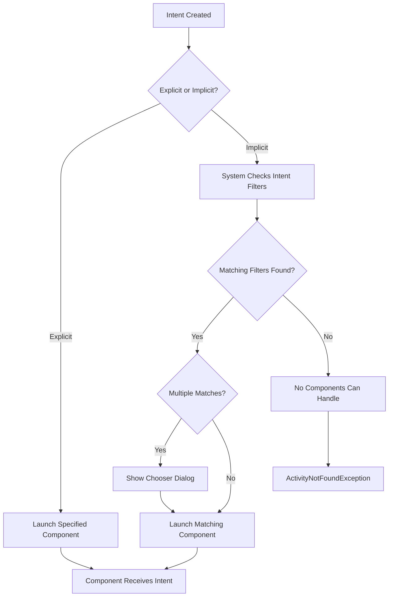
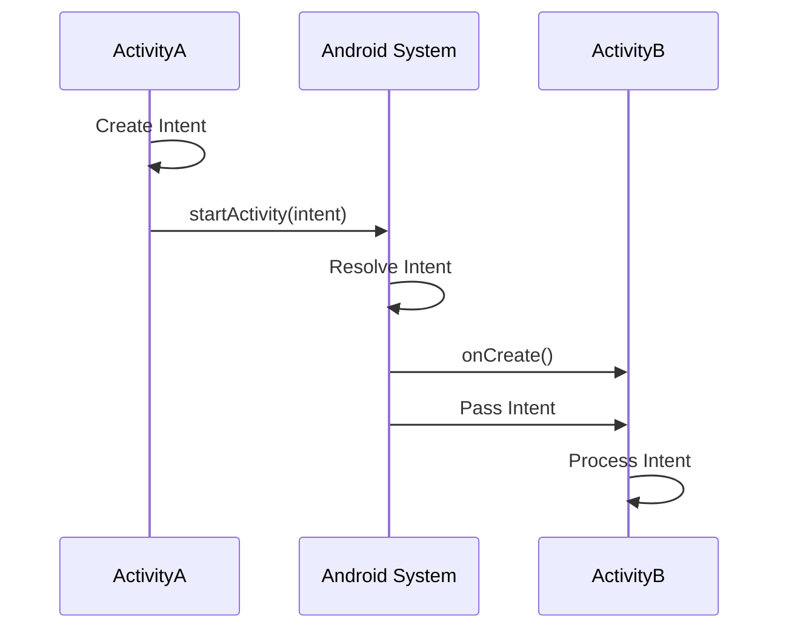
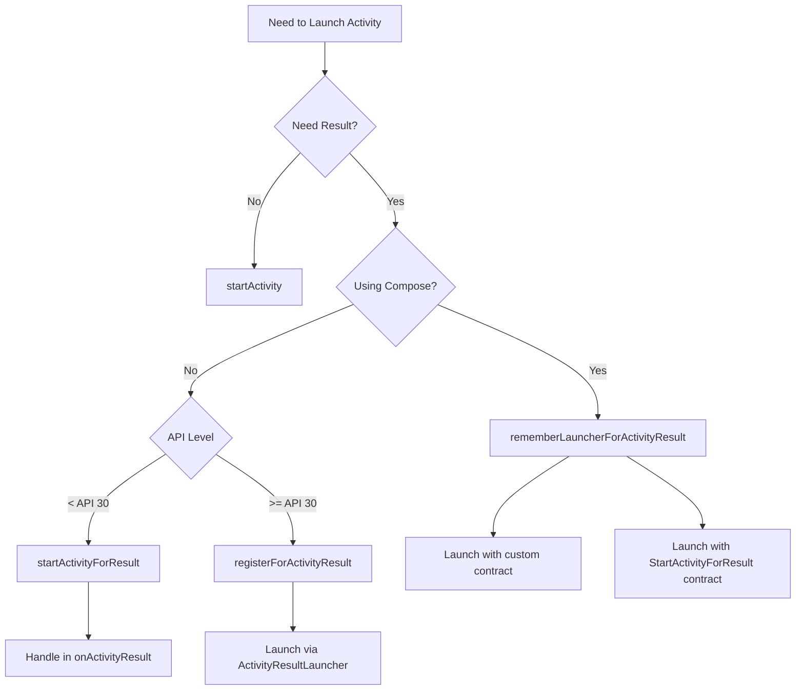
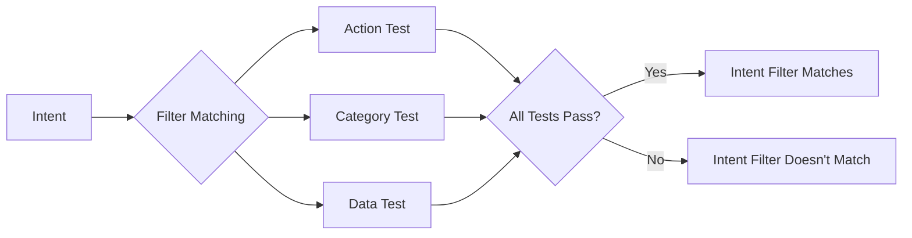
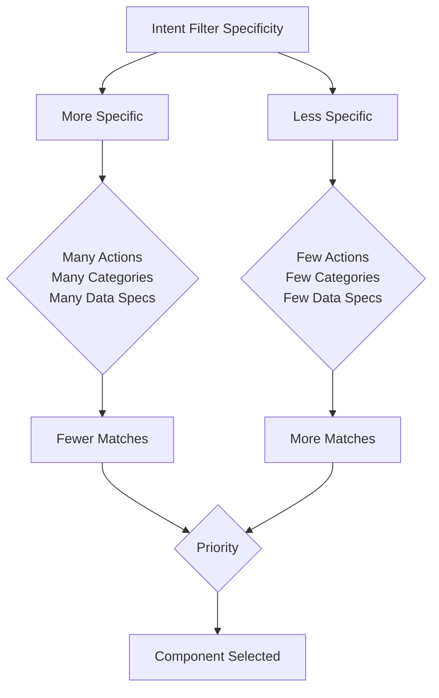
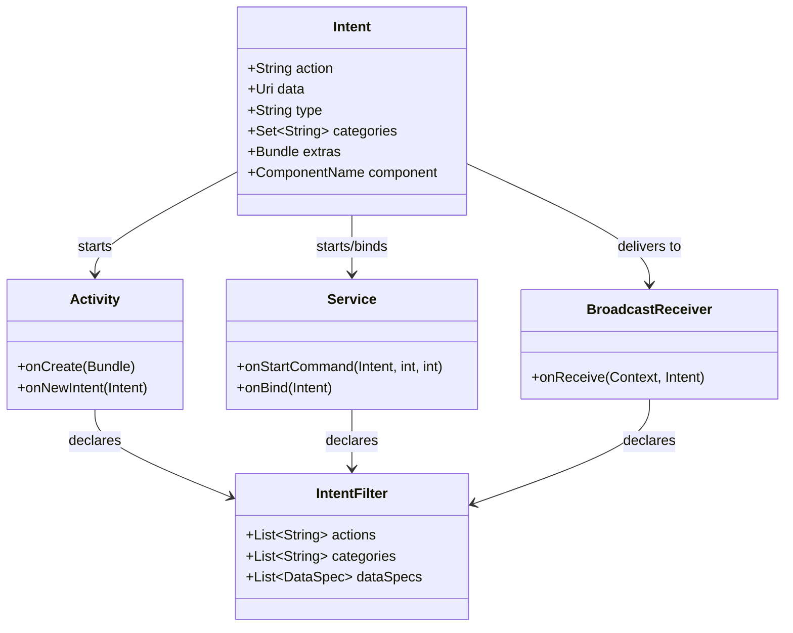
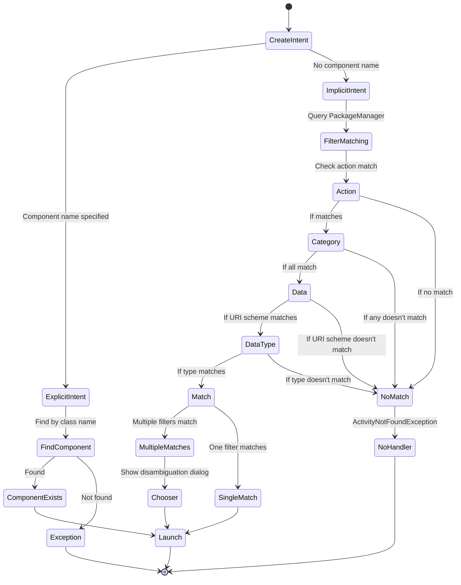

# Android Intents and Intent Filters

## Introduction

Intents are messaging objects used to request actions from other app components. They facilitate communication between components of the same app as well as between different apps. Intents are a fundamental part of Android's inter-component communication system.

[link](https://developer.android.com/training/basics/intents?_gl=1*1goz337*_up*MQ..*_ga*NTY3MjYyODA2LjE3NDYzOTQ4ODA.*_ga_6HH9YJMN9M*MTc0NjM5NDg4MC4xLjAuMTc0NjM5NTA2NS4wLjAuMTgxMjkyMzc0)

## Types of Intents

### Explicit Intents

Explicit intents specify the exact component (activity, service, etc.) to start by name. They are typically used for communication within an app.

```kotlin
val intent = Intent(context, SecondActivity::class.java)
intent.putExtra("key", "value")
startActivity(intent)
```

### Implicit Intents

Implicit intents don't specify a component but declare a general action to perform. The Android system finds appropriate components that can handle the intent.

```kotlin
val intent = Intent(Intent.ACTION_VIEW, Uri.parse("https://developer.android.com"))
startActivity(intent)
```

## Intent Components

| Component | Description | Example |
|-----------|-------------|---------|
| Action | String naming the action to be performed | `Intent.ACTION_VIEW`, `Intent.ACTION_SEND` |
| Data | URI of the data to operate on | `Uri.parse("https://example.com")` |
| Category | String containing additional information about the kind of component that should handle the intent | `Intent.CATEGORY_LAUNCHER` |
| Type | MIME type of the data | `"text/plain"`, `"image/*"` |
| Component | Specific component to start | `ComponentName(context, MyActivity::class.java)` |
| Extras | Key-value pairs for additional information | `putExtra("key", "value")` |
| Flags | Control how the intent is handled | `Intent.FLAG_ACTIVITY_NEW_TASK` |

## Intent Filters

Intent filters declare the capabilities of a component - what kinds of intents it can handle. They are defined in the AndroidManifest.xml file.

```xml
<activity android:name=".ImplicitIntentActivity">
    <intent-filter>
        <action android:name="android.intent.action.VIEW" />
        <category android:name="android.intent.category.DEFAULT" />
        <category android:name="android.intent.category.BROWSABLE" />
        <data android:scheme="http" />
    </intent-filter>
</activity>
```

## Common Intent Actions

| Action | Description |
|--------|-------------|
| `ACTION_VIEW` | Display data to the user |
| `ACTION_SEND` | Share content with another app |
| `ACTION_DIAL` | Initiate a phone call |
| `ACTION_MAIN` | Start as a main entry point |
| `ACTION_EDIT` | Edit an item |
| `ACTION_PICK` | Pick an item from data |
| `ACTION_SEARCH` | Search for data |

## Common Intent Categories

| Category | Description |
|----------|-------------|
| `CATEGORY_DEFAULT` | Default category required for implicit intents |
| `CATEGORY_BROWSABLE` | Can be started by a web browser |
| `CATEGORY_LAUNCHER` | Appear in the launcher as a top-level app |
| `CATEGORY_HOME` | Home screen activity |
| `CATEGORY_APP_MUSIC` | Music app |
| `CATEGORY_APP_GALLERY` | Gallery app |

## Intent Resolution Process



## Intent Flow Between Components



## Common Intent Use Cases

### Sharing Content

```kotlin
val intent = Intent(Intent.ACTION_SEND).apply {
    type = "text/plain"
    putExtra(Intent.EXTRA_SUBJECT, "Subject Title")
    putExtra(Intent.EXTRA_TEXT, "Content to share")
}
startActivity(Intent.createChooser(intent, "Share via"))
```

### Opening a URL

```kotlin
val intent = Intent(Intent.ACTION_VIEW, Uri.parse("https://example.com"))
startActivity(intent)
```

### Making a Call

```kotlin
val intent = Intent(Intent.ACTION_DIAL, Uri.parse("tel:1234567890"))
startActivity(intent)
```

## Activity Launch Methods

Different methods are available for launching activities with intents, depending on whether you're using traditional Android or Jetpack Compose, and whether you need a result back.

| Method | Context | Description | Example | Result Handling |
|--------|---------|-------------|---------|----------------|
| `startActivity()` | Traditional Android | Launches an activity without expecting a result | `startActivity(Intent(context, SecondActivity::class.java))` | N/A |
| `startActivityForResult()` | Traditional Android (Deprecated) | Launches an activity expecting a result | `startActivityForResult(intent, REQUEST_CODE)` | Override `onActivityResult()` to handle returned data |
| `registerForActivityResult()` | AndroidX Activity | Modern replacement for startActivityForResult | `registerForActivityResult(ActivityResultContracts.StartActivityForResult()) { result -> /* handle result */ }` | Callback provided in the registration |
| `rememberLauncherForActivityResult()` | Jetpack Compose | Compose-specific way to launch activities with results | `val launcher = rememberLauncherForActivityResult(ActivityResultContracts.StartActivityForResult()) { result -> /* handle result */ }` | Callback provided in the launcher definition |
| `rememberLauncherForActivityResult()` with custom contract | Jetpack Compose | For specific data types like images, permissions | `val launcher = rememberLauncherForActivityResult(ActivityResultContracts.TakePicture()) { success -> /* handle success boolean */ }` | Type-specific result handling |
| `ActivityResultLauncher.launch()` | Both | Method to launch the activity after registering | `launcher.launch(intent)` or `launcher.launch(uri)` | N/A (handled in registration) |
| `Intent.createChooser()` | Both | Creates a chooser dialog for implicit intents | `startActivity(Intent.createChooser(intent, "Select an app"))` | Uses any of the above methods for launching |

### Comparison of Activity Launch Methods



### Available ActivityResultContracts

When using `registerForActivityResult()` or `rememberLauncherForActivityResult()`, you need to specify a contract that defines the input type and expected result type. AndroidX provides several built-in contracts:

| Contract | Input Type | Result Type | Description |
|----------|------------|-------------|-------------|
| `StartActivityForResult` | `Intent` | `ActivityResult` | General purpose contract for starting activities and getting results |
| `RequestPermission` | `String` | `Boolean` | Request a single permission and get granted status |
| `RequestMultiplePermissions` | `Array<String>` | `Map<String, Boolean>` | Request multiple permissions and get granted status for each |
| `TakePicturePreview` | `Unit` (no input) | `Bitmap?` | Take a photo and get a thumbnail bitmap |
| `TakePicture` | `Uri` | `Boolean` | Take a photo and save to provided Uri |
| `CaptureVideo` | `Uri` | `Boolean` | Capture video and save to provided Uri |
| `PickContact` | `Unit` (no input) | `Uri?` | Pick a contact from the device |
| `GetContent` | `String` (MIME type) | `Uri?` | Pick content of specified type (e.g., "image/*") |
| `GetMultipleContents` | `String` (MIME type) | `List<Uri>` | Pick multiple items of specified type |
| `OpenDocument` | `Array<String>` (MIME types) | `Uri?` | Open a document of specified types |
| `OpenMultipleDocuments` | `Array<String>` (MIME types) | `List<Uri>` | Open multiple documents of specified types |
| `OpenDocumentTree` | `Uri?` (initial Uri) | `Uri?` | Pick a directory |
| `CreateDocument` | `String` (document name) | `Uri?` | Create a new document |

#### Example Usage with Compose

```kotlin
// Example: Take a picture with Compose
val takePictureLauncher = rememberLauncherForActivityResult(
    contract = ActivityResultContracts.TakePicturePreview()
) { bitmap ->
    // Handle the bitmap result
    if (bitmap != null) {
        // Process the captured image
    }
}

// Usage
Button(onClick = { takePictureLauncher.launch(null) }) {
    Text("Take Picture")
}
```

## Intent Filter Matching Logic



1. **Action Test**: The intent's action must match one of the actions listed in the filter
2. **Category Test**: The intent must pass for every category in the filter
3. **Data Test**: The intent's data URI and MIME type must match the filter's specifications

## Intent Filter Specificity

The more specific an intent filter, the less likely it is to match an incoming intent:



## Best Practices

1. **Use explicit intents** for internal app communication
2. **Use implicit intents** for external app communication
3. **Include CATEGORY_DEFAULT** in intent filters for implicit intents
4. **Handle exceptions** for unresolved implicit intents
5. **Verify before sending** sensitive data via intents
6. **Consider security** when receiving intents

## Security Considerations

### Sending Intents

- Be cautious with sensitive data in implicit intents
- Use `resolveActivity()` to check if any app can handle your intent
- Consider `startActivityForResult()` for secure communication

### Receiving Intents

- Validate incoming intent data
- Don't trust data from external sources
- Consider using signature-based permissions

## MIME Types and Data URIs

| MIME Type | Description | Example URI |
|-----------|-------------|-------------|
| `text/plain` | Plain text | `content://contacts/people/1` |
| `text/html` | HTML text | `file:///path/file.html` |
| `image/*` | Any image | `content://media/external/images/1` |
| `audio/*` | Any audio | `content://media/external/audio/1` |
| `video/*` | Any video | `content://media/external/video/1` |
| `application/pdf` | PDF file | `file:///path/document.pdf` |
| `application/json` | JSON data | N/A |

## Component Relationship with Intents



## Common Intent Flags

| Flag | Description |
|------|-------------|
| `FLAG_ACTIVITY_NEW_TASK` | Start activity in a new task |
| `FLAG_ACTIVITY_CLEAR_TOP` | Clear all activities above in the stack |
| `FLAG_ACTIVITY_SINGLE_TOP` | Don't launch a new instance if one exists at the top |
| `FLAG_GRANT_READ_URI_PERMISSION` | Grant read permission on URI |
| `FLAG_GRANT_WRITE_URI_PERMISSION` | Grant write permission on URI |
| `FLAG_ACTIVITY_NO_HISTORY` | Don't keep in the history stack |
| `FLAG_ACTIVITY_REORDER_TO_FRONT` | Bring activity to front if it exists |

## Intent Resolution Process in Detail



## References

- [Android Developer Documentation on Intents](https://developer.android.com/guide/components/intents-filters)
- [Implicit vs Explicit Intents](https://developer.android.com/training/basics/intents)
- [Common Intents](https://developer.android.com/guide/components/intents-common)

`