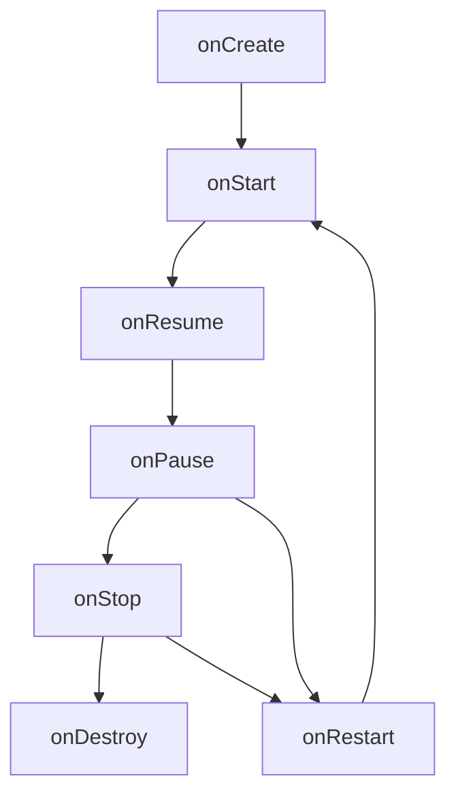
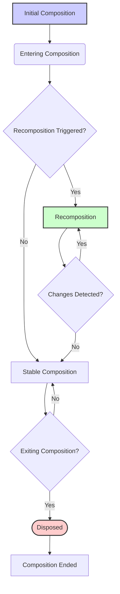

# 🌀 Lifecycle in Jetpack Compose
## Activity/Fragment/View vs Composables
Key Differences Summarized

| Feature           | Activities/Fragments (View System)                       | Jetpack Compose                                          |
| ----------------- | ------------------------------------------------------- | -------------------------------------------------------- |
| **UI Paradigm**       | Imperative (you tell the system how to change things)  | Declarative (you describe what the UI should look like) |
| **Building Blocks**   | `View`s, XML layouts                                    | `@Composable` functions                                   |
| **State Management**  | Manual updates to `View` objects                         | State-driven, automatic recomposition                    |
| **UI Definition**     | XML and code                                            | Kotlin code only                                         |
| **UI Changes**        | Mutable `View`s                                          | Immutable UI, recomposed when state changes             |
| **UI Updates**        | Imperative code to modify the `View` hierarchy           | Declarative description of state, recomposition          |
| **UI Reusability**    | Possible, but often requires custom `View`s               | Composable functions encourage reusability               |
| **Lifecycle Management** | Activity and Fragment lifecycles| No separate lifecycle, state management handles similar concerns |

## 📊 What Is Lifecycle?

In Android, **lifecycle** refers to the different stages a component (like an `Activity`, `Fragment`, or `Composable`) 
goes through from creation to destruction.

Jetpack Compose introduces a distinct **composition lifecycle** that integrates with, but also differs from, 
the traditional Android lifecycle. It is driven by UI state and recomposition rather than explicit lifecycle callbacks.

---

## 🔁 Android Lifecycle Diagram

Here’s a simplified diagram of the **Android Activity lifecycle** and its state transitions:



- `onCreate` – Initialization logic (UI, bindings, ViewModel)
- `onStart` – UI becomes visible
- `onResume` – UI becomes interactive
- `onPause` – Partially obscured (e.g., dialog or multitasking)
- `onStop` – Completely hidden (background)
- `onRestart` – Coming back to foreground
- `onDestroy` – Cleanup before the component is destroyed

---

| Component          | Key Class/Interface | Lifecycle State Events Observed                                                                    | Purpose                                                                                                                                | Common Use Cases                                                                                           |
| ------------------ | ------------------- | --------------------------------------------------------------------------------------------------- | -------------------------------------------------------------------------------------------------------------------------------------- | ---------------------------------------------------------------------------------------------------------- |
| **LifecycleOwner** | `LifecycleOwner`    | All `Lifecycle.Event`s (e.g., `ON_CREATE`, `ON_START`, `ON_RESUME`, `ON_PAUSE`, `ON_STOP`, `ON_DESTROY`) | An interface indicating a class has a lifecycle. It exposes its `Lifecycle` to observers.                                         | Activities and Fragments are `LifecycleOwner`s. You can implement this interface if you need custom lifecycle management. |
| **Lifecycle**      | `Lifecycle`         | `Lifecycle.Event`s and `Lifecycle.State`s.                                                          | Represents the lifecycle state of a component (like an Activity or Fragment).                                                              | Used by `LifecycleOwner` to manage and expose lifecycle state. Observers register with the `Lifecycle` object. |
| **LifecycleObserver** | `LifecycleObserver` | All `Lifecycle.Event`s via annotated methods (`@OnLifecycleEvent`)                                     | An interface indicating a class is a lifecycle observer.                                                                                    | Classes that need to be notified of lifecycle changes.                                                       |
| **DefaultLifecycleObserver** | `DefaultLifecycleObserver` | All `Lifecycle.Event`s via methods (`onCreate`, `onStart`, `onResume`, `onPause`, `onStop`, `onDestroy`) | An interface that provides default empty implementations for each lifecycle method to implement specific events. | If you want to receive multiple lifecycle events, it helps you to avoid implementing empty functions.        |
| **ProcessLifecycleOwner** | `ProcessLifecycleOwner` | `ON_START`, `ON_RESUME`, `ON_PAUSE`, `ON_STOP`  of the entire application process. | Represents the lifecycle of the whole application process, not a single activity or fragment. | Track when the app is in the foreground or background. Perform actions that should occur at the application level. |

---

## Compose Lifecycle

## 🔍 Android Lifecycle vs Compose Lifecycle

| Aspect                     | Android Lifecycle                                      | Compose Lifecycle                                       |
|----------------------------|--------------------------------------------------------|---------------------------------------------------------|
| **Owner**                  | `Activity` / `Fragment`                                | Composable function                                     |
| **Core stages**            | `onCreate`, `onStart`, `onResume`, `onPause`, etc.     | Enter composition, recomposition, leave composition     |
| **Managed by**             | Android OS + `LifecycleOwner`                         | Compose runtime engine                                  |
| **Observation mechanism**  | `LifecycleObserver`, `LiveData`, `Flow`, etc.         | `LaunchedEffect`, `DisposableEffect`, `SideEffect`      |
| **Purpose**                | Manage visibility and app state                        | Manage UI rendering and side effects                    |

---

## 🗖️ Observing Lifecycle in Compose

Use `LocalLifecycleOwner` to observe the Android lifecycle within a Composable.

```kotlin
@Composable
fun ObserveLifecycle() {
    val lifecycleOwner = LocalLifecycleOwner.current

    DisposableEffect(lifecycleOwner) {
        val observer = LifecycleEventObserver { _, event ->
            Log.d("Lifecycle", "Observed: $event")
        }
        lifecycleOwner.lifecycle.addObserver(observer)

        onDispose {
            lifecycleOwner.lifecycle.removeObserver(observer)
        }
    }
}
```
- LocalLifecycleOwner.current: Provides a way for composables to access 
  the LifecycleOwner of the Activity or Fragment.
- LifecycleEventObserver: Allows you to listen to lifecycle events 
  and execute code in response.
- Together, they allow you to make your composables 
  "lifecycle aware" even though they don't have their own lifecycle.

✅ **Useful for**:
- Logging lifecycle events
- Tracking foreground/background transitions
- Controlling media (e.g., pause video on `ON_PAUSE`)

---

## 🔄 Composition Lifecycle in Compose

Jetpack Compose has its own lifecycle managed internally:

| Term               | Description                                                    |
|--------------------|----------------------------------------------------------------|
| **Composition**    | When a composable is initially added to the UI tree            |
| **Recomposition**  | When the composable is re-invoked due to state changes         |
| **Decomposition**  | When the composable is removed from the UI                     |

🛠 You can hook into these phases with:

- `LaunchedEffect`
- `DisposableEffect`
- `SideEffect`

---

## 🧪 Example: Respond to Lifecycle Events

```kotlin
@Composable
fun LogOnResume() {
    val lifecycle = LocalLifecycleOwner.current.lifecycle

    DisposableEffect(lifecycle) {
        val observer = LifecycleEventObserver { _, event ->
            if (event == Lifecycle.Event.ON_RESUME) {
                Log.d("ComposeLifecycle", "App resumed")
            }
        }
        lifecycle.addObserver(observer)

        onDispose {
            lifecycle.removeObserver(observer)
        }
    }
}
```

✅ **Scenario**: You want to trigger an action (e.g., resume a game or video) when the app returns to the foreground.

---

## 🧰 Compose Lifecycle-Aware APIs

| API                      | Description                                                   | Triggered When                                 |
|--------------------------|---------------------------------------------------------------|------------------------------------------------|
| `LaunchedEffect(key)`    | Launch coroutine on first composition or when key changes     | On composition or key change                   |
| `DisposableEffect(key)`  | Setup/cleanup logic tied to composable's lifecycle            | On key change or disposal                      |
| `SideEffect`             | Execute sync logic after every recomposition                  | After each recomposition                       |
| `rememberUpdatedState`   | Capture the latest value inside long-lived effect blocks      | Keeps state up-to-date without recomposition   |

---

## ⚠️ Common Lifecycle Pitfalls

| Mistake                                             | Fix / Best Practice                                              |
|------------------------------------------------------|------------------------------------------------------------------|
| ❌ Triggering suspend functions outside effects       | ✅ Use `LaunchedEffect` to run coroutines                        |
| ❌ Not cleaning up listeners/observers                | ✅ Use `onDispose` block in `DisposableEffect`                   |
| ❌ Using `GlobalScope` inside Composables             | ✅ Use `rememberCoroutineScope`, `viewModelScope`, etc.          |
| ❌ Performing expensive work during recomposition     | ✅ Move side effects to `LaunchedEffect` or `SideEffect`         |

---

## 🧑‍💻 Practice Tasks for Mastery

| Task                                       | Learning Outcome                                             |
|--------------------------------------------|--------------------------------------------------------------|
| Log lifecycle event when screen resumes    | Use `ON_RESUME` with `LifecycleEventObserver`               |
| Pause/resume a countdown timer             | Observe `ON_PAUSE` and `ON_RESUME` to control state         |
| Cancel a network call when leaving screen  | Wrap logic in `LaunchedEffect` and clean up in `DisposableEffect` |
| Reflect state change after recomposition   | Use `SideEffect` to update sync UI values                   |

---

