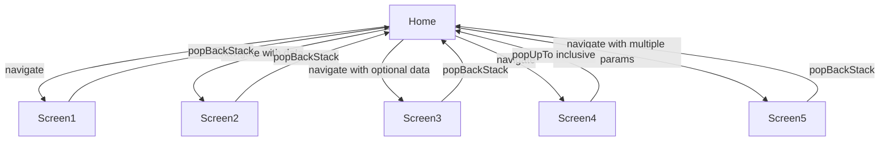
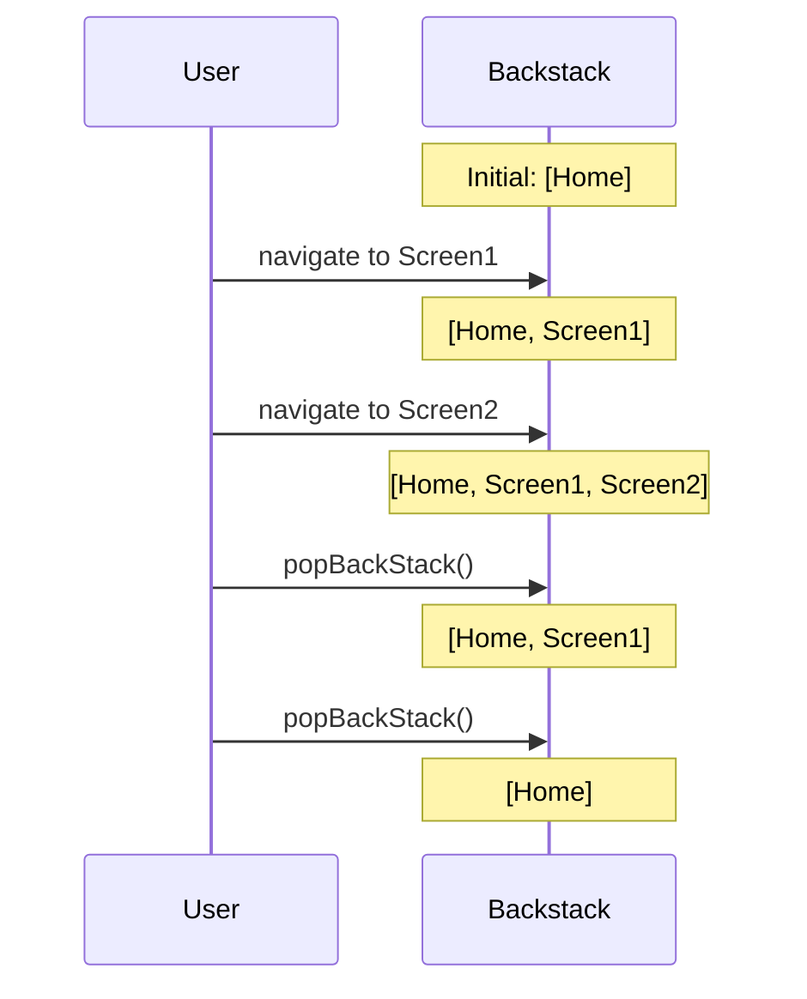
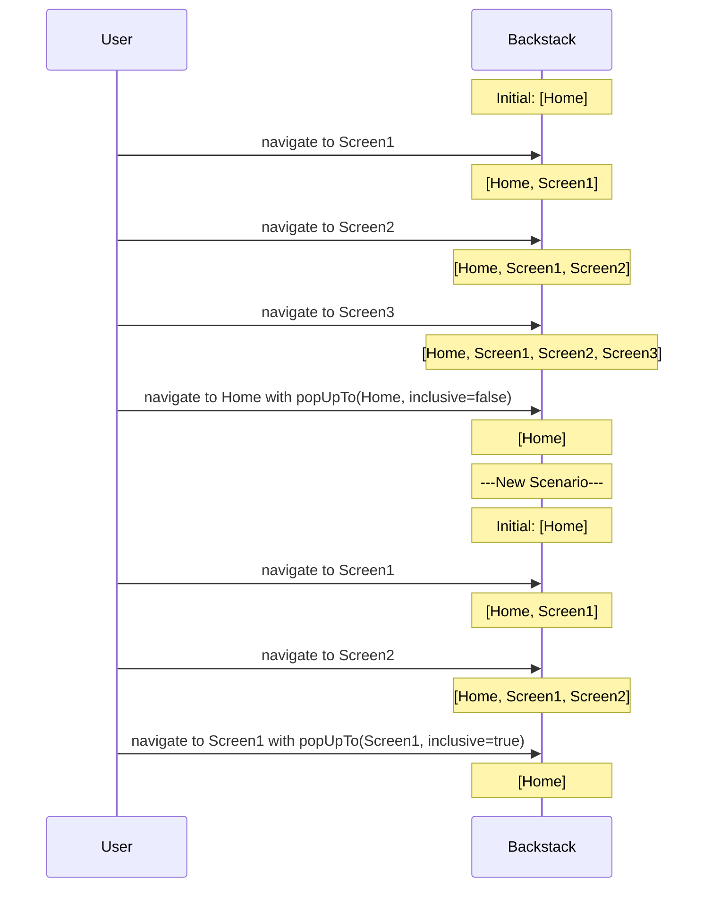
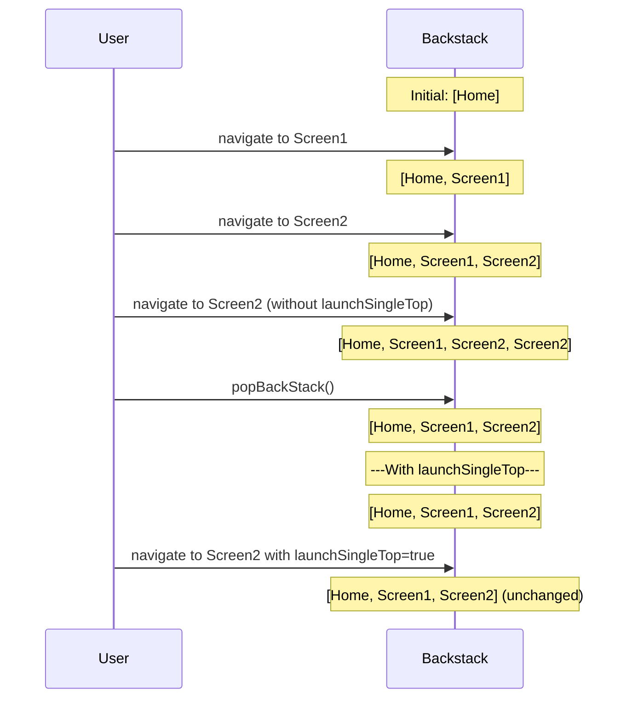
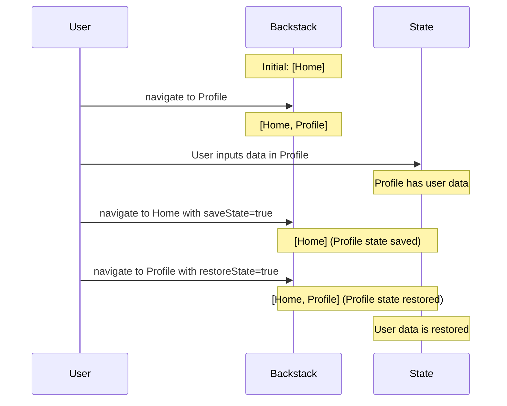
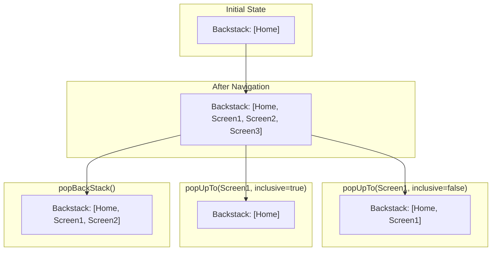
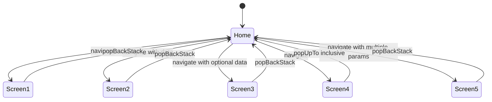
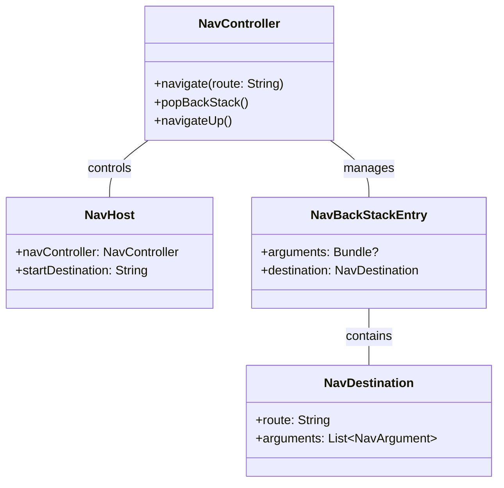

# Jetpack Compose Navigation

## Table of Contents
- [Introduction](#introduction)
- [Setup](#setup)
- [Navigation Concepts](#navigation-concepts)
- [Navigation Types](#navigation-types)
- [Navigation Actions](#navigation-actions)
- [Navigation Graph Visualization](#navigation-graph-visualization)
- [Backstack Operations](#backstack-operations)
- [Common Patterns](#common-patterns)
- [Best Practices](#best-practices)
- [Complete Example](#complete-example)

## Introduction

Jetpack Compose Navigation is a framework that allows you to implement navigation between composables in your Jetpack Compose application. It provides a consistent way to handle navigation, arguments passing, deep links, and back stack management.

## Setup

### Dependencies

Add the following dependencies to your app's `build.gradle` file:

```kotlin
dependencies {
    implementation("androidx.navigation:navigation-compose:2.7.7")
}
```

## Navigation Concepts

### Core Components

| Component | Description |
|-----------|-------------|
| `NavController` | Central API for navigation. Tracks back stack and destination changes. |
| `NavHost` | Composable that hosts navigation graph and displays current destination. |
| `NavGraph` | Collection of destinations and the routes between them. |
| `NavBackStackEntry` | Contains state and arguments for a destination on the back stack. |
| `NavDeepLink` | Links to specific destinations in your app. |

## Navigation Types

### Basic Navigation

The simplest form of navigation between screens without passing any data.

```kotlin
@Composable
fun BasicNavigation() {
    val navController = rememberNavController()
    NavHost(navController = navController, startDestination = "home") {
        composable("home") { HomeScreen(navController) }
        composable("profile") { ProfileScreen(navController) }
    }
}

@Composable
fun HomeScreen(navController: NavHostController) {
    Column(
        modifier = Modifier.fillMaxSize(),
        horizontalAlignment = Alignment.CenterHorizontally,
        verticalArrangement = Arrangement.Center
    ) {
        Text(text = "Home Screen")
        Button(onClick = { navController.navigate("profile") }) {
            Text("Go to Profile")
        }
    }
}
```

### Navigation with Required Arguments

Pass required data between destinations.

```kotlin
NavHost(navController = navController, startDestination = "home") {
    composable("home") { HomeScreen(navController) }
    composable(
        route = "detail/{itemId}",
        arguments = listOf(navArgument("itemId") { type = NavType.StringType })
    ) { backStackEntry ->
        DetailScreen(
            navController = navController,
            itemId = backStackEntry.arguments?.getString("itemId")
        )
    }
}

// Navigate with arguments
navController.navigate("detail/item123")
```

### Navigation with Optional Arguments

Pass optional data between destinations.

```kotlin
NavHost(navController = navController, startDestination = "home") {
    composable("home") { HomeScreen(navController) }
    composable(
        route = "profile?userId={userId}",
        arguments = listOf(navArgument("userId") {
            type = NavType.StringType
            defaultValue = "default"
            nullable = true
        })
    ) { backStackEntry ->
        ProfileScreen(
            navController = navController,
            userId = backStackEntry.arguments?.getString("userId")
        )
    }
}

// Navigate with optional argument
navController.navigate("profile?userId=user123")
// Or without the optional argument
navController.navigate("profile")
```

### Navigation with Multiple Arguments

Pass multiple parameters to a destination.

```kotlin
NavHost(navController = navController, startDestination = "home") {
    composable("home") { HomeScreen(navController) }
    composable(
        route = "search?query={query}&category={category}",
        arguments = listOf(
            navArgument("query") {
                type = NavType.StringType
                defaultValue = ""
            },
            navArgument("category") {
                type = NavType.StringType
                defaultValue = "all"
            }
        )
    ) { backStackEntry ->
        SearchScreen(
            navController = navController,
            query = backStackEntry.arguments?.getString("query") ?: "",
            category = backStackEntry.arguments?.getString("category") ?: "all"
        )
    }
}

// Navigate with multiple arguments
navController.navigate("search?query=shoes&category=footwear")
```

## Navigation Actions

| Action | Description | Example |
|--------|-------------|---------|
| navigate | Navigate to a destination | `navController.navigate("profile")` |
| popBackStack | Go back to the previous destination | `navController.popBackStack()` |
| popUpTo | Pop up to a specific destination | `navController.navigate("home") { popUpTo("home") { inclusive = true } }` |
| navigateUp | Navigate up in the app hierarchy | `navController.navigateUp()` |

### Navigate

```kotlin
// Simple navigation
navController.navigate("profile")

// Navigate with options
navController.navigate("profile") {
    // Pop all destinations up to home from the back stack
    popUpTo("home")
    // Avoid multiple copies of the same destination
    launchSingleTop = true
    // Restore any saved state when returning to a previously visited destination
    restoreState = true
}
```

### PopBackStack

```kotlin
// Go back to previous screen
navController.popBackStack()

// Go back to a specific destination
navController.popBackStack("home", inclusive = false)

// Go back to a specific destination and remove it from back stack
navController.popBackStack("home", inclusive = true)
```

### Clear Backstack

```kotlin
navController.navigate("home") {
    popUpTo("home") {
        inclusive = true
    }
}
```

## Navigation Graph Visualization



## Backstack Operations

### Basic Navigation Effect on Backstack



### PopUpTo Operations



### SingleTop Navigation



### SaveState and RestoreState



### Complex Backstack Operations Example



## Common Patterns

### Nested Navigation

```kotlin
NavHost(navController = navController, startDestination = "main") {
    composable("main") { MainScreen(navController) }
    navigation(
        startDestination = "profile/info",
        route = "profile"
    ) {
        composable("profile/info") { ProfileInfoScreen(navController) }
        composable("profile/settings") { ProfileSettingsScreen(navController) }
    }
}

// Navigate to nested destination
navController.navigate("profile/settings")
```

### Bottom Navigation

```kotlin
@Composable
fun MainScreen() {
    val navController = rememberNavController()
    
    Scaffold(
        bottomBar = {
            BottomNavigation {
                BottomNavigationItem(
                    selected = /* check if home is selected */,
                    onClick = { navController.navigate("home") {
                        popUpTo("main") {
                            saveState = true
                        }
                        launchSingleTop = true
                        restoreState = true
                    }},
                    icon = { Icon(Icons.Default.Home, contentDescription = null) },
                    label = { Text("Home") }
                )
                
                BottomNavigationItem(
                    selected = /* check if profile is selected */,
                    onClick = { navController.navigate("profile") {
                        popUpTo("main") {
                            saveState = true
                        }
                        launchSingleTop = true
                        restoreState = true
                    }},
                    icon = { Icon(Icons.Default.Person, contentDescription = null) },
                    label = { Text("Profile") }
                )
            }
        }
    ) { innerPadding ->
        NavHost(
            navController = navController,
            startDestination = "home",
            modifier = Modifier.padding(innerPadding)
        ) {
            composable("home") { HomeScreen() }
            composable("profile") { ProfileScreen() }
        }
    }
}
```

## Best Practices

1. **Route Constants**: Define route strings as constants to avoid typos and enable refactoring.

```kotlin
object NavigationRoutes {
    const val HOME = "home"
    const val PROFILE = "profile"
    const val DETAIL = "detail/{itemId}"
    
    // Use this function to create routes with parameters
    fun detailRoute(itemId: String) = "detail/$itemId"
}
```

2. **Consistent Arguments Handling**: Create extension functions to handle arguments consistently.

```kotlin
fun NavBackStackEntry.getStringArg(key: String): String? = arguments?.getString(key)
fun NavBackStackEntry.getIntArg(key: String): Int? = arguments?.getInt(key)
```

3. **NavDestination**: Encapsulate navigation logic in a sealed class.

```kotlin
sealed class NavDestination(val route: String) {
    object Home : NavDestination("home")
    object Profile : NavDestination("profile")
    
    object Detail : NavDestination("detail/{itemId}") {
        fun createRoute(itemId: String) = "detail/$itemId"
    }
}
```

## Complete Example

Here's a complete example showing different navigation types:

```kotlin
@Composable
fun MainNavigation() {
    val navController = rememberNavController()
    NavHost(navController = navController, startDestination = "home") {
        composable("home") { HomeScreen(navController) }
        composable("screen1") { Screen1(navController) }
        composable(
            route = "screen2/{data}",
            arguments = listOf(navArgument("data") { type = NavType.StringType })
        ) { backStackEntry ->
            Screen2(navController, data = backStackEntry.arguments?.getString("data"))
        }
        composable("screen3?optionalData={optionalData}",
            arguments = listOf(navArgument("optionalData"){
                type = NavType.StringType
                defaultValue = "Default Optional Data"
            })
        ) { backStackEntry ->
            Screen3(navController, backStackEntry.arguments?.getString("optionalData"))
        }
        composable("screen4") {
            Screen4(navController)
        }
        composable(
            route = "screen5?name={name}&age={age}",
            arguments = listOf(
                navArgument("name") {
                    type = NavType.StringType
                    defaultValue = "Guest"
                    nullable = true
                },
                navArgument("age") {
                    type = NavType.IntType
                    defaultValue = 0
                }
            )
        ) { backStackEntry ->
            Screen5(
                navController = navController,
                name = backStackEntry.arguments?.getString("name"),
                age = backStackEntry.arguments?.getInt("age") ?: 0
            )
        }
    }
}
```

## Argument Types Table

| Type | Kotlin Type | Description | Example |
|------|------------|-------------|---------|
| NavType.StringType | String | Text values | `navArgument("name") { type = NavType.StringType }` |
| NavType.IntType | Int | Integer values | `navArgument("age") { type = NavType.IntType }` |
| NavType.LongType | Long | Long integer values | `navArgument("timestamp") { type = NavType.LongType }` |
| NavType.FloatType | Float | Floating point values | `navArgument("price") { type = NavType.FloatType }` |
| NavType.BoolType | Boolean | Boolean values | `navArgument("isAdmin") { type = NavType.BoolType }` |
| NavType.ReferenceType | Parcelable | Complex objects (must implement Parcelable) | `navArgument("user") { type = NavType.ReferenceType(User::class.java) }` |

## Navigation Flow Diagram



## Navigation Structure


