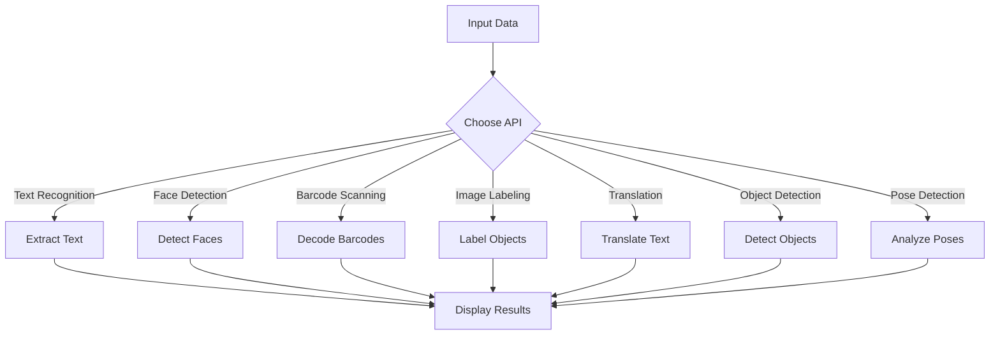

# ML Kit: Machine Learning for Mobile Developers

## Introduction
ML Kit is Google's mobile SDK that simplifies integrating machine learning into Android and iOS apps. It provides pre-trained APIs and tools for deploying custom models, enabling developers to create innovative features without deep ML expertise. With ML Kit, you can focus on building great apps while leveraging the power of machine learning.

Other approaches to integrating ML into mobile apps include frameworks like TensorFlow Lite, Core ML (iOS), or cloud-based services such as Google Cloud AI, AWS SageMaker, and Azure Machine Learning.

### AI Methods in Android

| Method                  | Description                                                                 |
|-------------------------|-----------------------------------------------------------------------------|
| ML Kit                 | Google's SDK for pre-trained and custom ML model integration.              |
| TensorFlow Lite        | Lightweight ML framework for deploying custom models on mobile devices.    |
| Core ML (iOS only)     | Apple's framework for integrating ML models into iOS apps.                 |
| REST APIs              | Cloud-based ML services like Google Cloud AI, AWS SageMaker, or Azure ML.  |
| ONNX Runtime           | Open Neural Network Exchange runtime for cross-platform ML model support.  |
| PyTorch Mobile         | Mobile-optimized version of PyTorch for deploying ML models.               |

## Key Features
- **Cross-platform support**: Works seamlessly on both Android and iOS platforms.
- **On-device processing**: Ensures low latency, offline functionality, and enhanced privacy.
- **Pre-trained APIs**: Includes APIs for text recognition, face detection, barcode scanning, image labeling, and more.
- **Custom model support**: Allows integration of TensorFlow Lite models for tailored use cases.
- **Ease of use**: Minimal setup and coding required, making it accessible for developers of all skill levels.
- **Object detection and tracking**: Detect and track objects in images or live camera feeds.
- **Pose detection**: Identify human body poses and landmarks for fitness or AR applications.

## Use Cases
- **Text Recognition**: Extract text from images for document scanning, translation apps, or accessibility tools.
- **Face Detection**: Identify faces and facial landmarks for photo editing, AR apps, or security features.
- **Barcode Scanning**: Decode barcodes for inventory management, payment systems, or retail apps.
- **Image Labeling**: Automatically tag objects in images for content categorization or search optimization.
- **Language Translation**: Translate text in real-time for multilingual applications or travel tools.
- **Object Detection**: Detect and track objects for AR experiences, inventory management, or gaming.
- **Pose Detection**: Analyze human poses for fitness apps, motion tracking, or sports analytics.

## ML Kit APIs Overview

| API                | Description                                      | On-device | Cloud-based |
|--------------------|--------------------------------------------------|-----------|-------------|
| Text Recognition   | Extracts text from images.                      | Yes       | Yes         |
| Face Detection     | Detects faces and facial landmarks.             | Yes       | No          |
| Barcode Scanning   | Scans and decodes barcodes.                     | Yes       | No          |
| Image Labeling     | Identifies objects in images.                   | Yes       | Yes         |
| Language ID        | Detects the language of a given text.           | Yes       | No          |
| Translation        | Translates text between languages.              | Yes       | Yes         |
| Smart Reply        | Suggests contextual replies for conversations.  | Yes       | No          |
| Object Detection   | Detects and tracks objects in images or video.  | Yes       | No          |
| Pose Detection     | Identifies human body poses and landmarks.      | Yes       | No          |

### API Templates

#### Text Recognition
```java
import com.google.mlkit.vision.common.InputImage;
import com.google.mlkit.vision.text.TextRecognition;
import com.google.mlkit.vision.text.TextRecognizer;

public void recognizeTextFromImage(Bitmap bitmap) {
    InputImage image = InputImage.fromBitmap(bitmap, 0);
    TextRecognizer recognizer = TextRecognition.getClient();

    recognizer.process(image)
        .addOnSuccessListener(result -> {
            String recognizedText = result.getText();
            // Handle recognized text
        })
        .addOnFailureListener(e -> {
            // Handle the error
        });
}
```

#### Face Detection
```java
import com.google.mlkit.vision.common.InputImage;
import com.google.mlkit.vision.face.FaceDetection;
import com.google.mlkit.vision.face.FaceDetector;
import com.google.mlkit.vision.face.Face;

public void detectFaces(Bitmap bitmap) {
    InputImage image = InputImage.fromBitmap(bitmap, 0);
    FaceDetector detector = FaceDetection.getClient();

    detector.process(image)
        .addOnSuccessListener(faces -> {
            for (Face face : faces) {
                // Handle detected faces
            }
        })
        .addOnFailureListener(e -> {
            // Handle the error
        });
}
```

#### Barcode Scanning
```java
import com.google.mlkit.vision.common.InputImage;
import com.google.mlkit.vision.barcode.BarcodeScanning;
import com.google.mlkit.vision.barcode.BarcodeScanner;
import com.google.mlkit.vision.barcode.Barcode;

public void scanBarcodes(Bitmap bitmap) {
    InputImage image = InputImage.fromBitmap(bitmap, 0);
    BarcodeScanner scanner = BarcodeScanning.getClient();

    scanner.process(image)
        .addOnSuccessListener(barcodes -> {
            for (Barcode barcode : barcodes) {
                // Handle scanned barcodes
            }
        })
        .addOnFailureListener(e -> {
            // Handle the error
        });
}
```

#### Image Labeling
```java
import com.google.mlkit.vision.common.InputImage;
import com.google.mlkit.vision.label.ImageLabeling;
import com.google.mlkit.vision.label.ImageLabeler;

public void labelImages(Bitmap bitmap) {
    InputImage image = InputImage.fromBitmap(bitmap, 0);
    ImageLabeler labeler = ImageLabeling.getClient();

    labeler.process(image)
        .addOnSuccessListener(labels -> {
            for (ImageLabel label : labels) {
                // Handle labeled objects
            }
        })
        .addOnFailureListener(e -> {
            // Handle the error
        });
}
```

#### Language ID
```java
import com.google.mlkit.nl.languageid.LanguageIdentification;

public void identifyLanguage(String text) {
    LanguageIdentification languageIdentifier = LanguageIdentification.getClient();

    languageIdentifier.identifyLanguage(text)
        .addOnSuccessListener(languageCode -> {
            // Handle identified language
        })
        .addOnFailureListener(e -> {
            // Handle the error
        });
}
```

#### Translation
```java
import com.google.mlkit.nl.translate.TranslateLanguage;
import com.google.mlkit.nl.translate.Translator;
import com.google.mlkit.nl.translate.TranslatorOptions;

public void translateText(String text) {
    TranslatorOptions options = new TranslatorOptions.Builder()
        .setSourceLanguage(TranslateLanguage.ENGLISH)
        .setTargetLanguage(TranslateLanguage.SPANISH)
        .build();
    Translator translator = Translation.getClient(options);

    translator.translate(text)
        .addOnSuccessListener(translatedText -> {
            // Handle translated text
        })
        .addOnFailureListener(e -> {
            // Handle the error
        });
}
```

#### Smart Reply
```java
import com.google.mlkit.nl.smartreply.SmartReply;
import com.google.mlkit.nl.smartreply.SmartReplySuggestion;

public void generateSmartReplies(List<String> conversation) {
    SmartReply.getClient().suggestReplies(conversation)
        .addOnSuccessListener(result -> {
            for (SmartReplySuggestion suggestion : result.getSuggestions()) {
                // Handle smart reply suggestions
            }
        })
        .addOnFailureListener(e -> {
            // Handle the error
        });
}
```

#### Object Detection
```java
import com.google.mlkit.vision.common.InputImage;
import com.google.mlkit.vision.objects.ObjectDetection;
import com.google.mlkit.vision.objects.ObjectDetector;

public void detectObjects(Bitmap bitmap) {
    InputImage image = InputImage.fromBitmap(bitmap, 0);
    ObjectDetector detector = ObjectDetection.getClient();

    detector.process(image)
        .addOnSuccessListener(objects -> {
            for (DetectedObject object : objects) {
                // Handle detected objects
            }
        })
        .addOnFailureListener(e -> {
            // Handle the error
        });
}
```

#### Pose Detection
```java
import com.google.mlkit.vision.common.InputImage;
import com.google.mlkit.vision.pose.PoseDetection;
import com.google.mlkit.vision.pose.PoseDetector;

public void detectPoses(Bitmap bitmap) {
    InputImage image = InputImage.fromBitmap(bitmap, 0);
    PoseDetector detector = PoseDetection.getClient();

    detector.process(image)
        .addOnSuccessListener(pose -> {
            // Handle detected pose
        })
        .addOnFailureListener(e -> {
            // Handle the error
        });
}
```

## ML Kit Workflow



## Implementations and Imports

### Android Example: Text Recognition

To use ML Kit's Text Recognition API in an Android app, include the following dependencies in your `build.gradle` file:

```gradle
dependencies {
    implementation 'com.google.mlkit:text-recognition:16.0.0'
}
```

Here is a sample implementation:

```java
import com.google.mlkit.vision.common.InputImage;
import com.google.mlkit.vision.text.TextRecognition;
import com.google.mlkit.vision.text.TextRecognizer;
import com.google.mlkit.vision.text.Text;

public void recognizeTextFromImage(Bitmap bitmap) {
    InputImage image = InputImage.fromBitmap(bitmap, 0);
    TextRecognizer recognizer = TextRecognition.getClient();

    recognizer.process(image)
        .addOnSuccessListener(result -> {
            String recognizedText = result.getText();
            // Handle recognized text
        })
        .addOnFailureListener(e -> {
            // Handle the error
        });
}
```

### Notes
- Ensure you have the necessary permissions (e.g., camera access) in your app.
- For custom models, use TensorFlow Lite and integrate them with ML Kit's APIs.
- Test your implementation on a variety of devices to ensure consistent performance.

## Best Practices
- **Optimize for On-Device Processing**: Use on-device APIs whenever possible to reduce latency and improve user privacy.
- **Handle Errors Gracefully**: Implement robust error handling to manage API failures or unexpected inputs.
- **Test Across Platforms**: Ensure your app behaves consistently on both Android and iOS devices.
- **Use Custom Models Judiciously**: Only use custom TensorFlow Lite models when pre-trained APIs do not meet your requirements.
- **Minimize Resource Usage**: Optimize memory and CPU usage to avoid degrading app performance, especially for real-time features like object detection.
- **Stay Updated**: Regularly update ML Kit dependencies to leverage the latest features and improvements.

## Conclusion
ML Kit empowers developers to integrate advanced machine learning features into their apps with minimal effort. Its pre-trained APIs, cross-platform support, and ability to integrate custom models make it a versatile tool for a wide range of applications. By following best practices and leveraging ML Kit's capabilities, developers can create innovative, efficient, and user-friendly mobile applications.

`
`
`