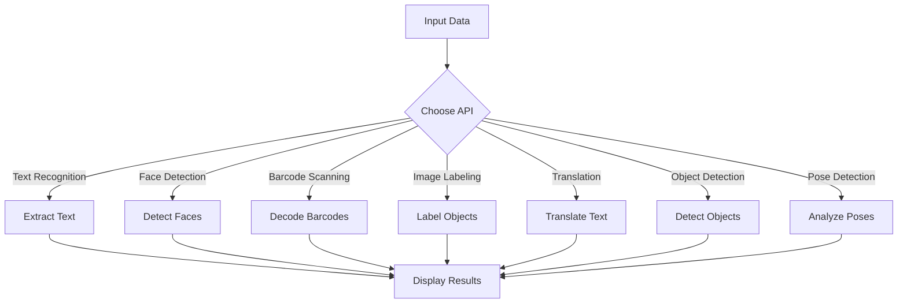

# ML Kit: Machine Learning for Mobile Developers

## Introduction
ML Kit is a mobile SDK provided by Google that enables developers to integrate machine learning capabilities into their Android and iOS apps. It simplifies the process of implementing ML models by offering pre-trained APIs and tools for custom model deployment.

## Key Features
- **Cross-platform support**: Works on both Android and iOS.
- **On-device processing**: Ensures low latency and offline functionality.
- **Pre-trained APIs**: Includes APIs for text recognition, face detection, barcode scanning, and more.
- **Custom model support**: Allows integration of TensorFlow Lite models.
- **Ease of use**: Minimal setup and coding required.
- **Object detection**: Detect and track objects in images or live camera feeds.
- **Pose detection**: Identify human body poses and landmarks.

## Use Cases
- **Text Recognition**: Extract text from images for document scanning or translation apps.
- **Face Detection**: Identify faces and facial landmarks for photo editing or AR apps.
- **Barcode Scanning**: Decode barcodes for inventory or payment systems.
- **Image Labeling**: Automatically tag objects in images for content categorization.
- **Language Translation**: Translate text in real-time for multilingual applications.
- **Object Detection**: Detect and track objects for AR experiences or inventory management.
- **Pose Detection**: Analyze human poses for fitness apps or motion tracking.

## ML Kit APIs Overview

| API                | Description                                      | On-device | Cloud-based |
|--------------------|--------------------------------------------------|-----------|-------------|
| Text Recognition   | Extracts text from images.                      | Yes       | Yes         |
| Face Detection     | Detects faces and facial landmarks.             | Yes       | No          |
| Barcode Scanning   | Scans and decodes barcodes.                     | Yes       | No          |
| Image Labeling     | Identifies objects in images.                   | Yes       | Yes         |
| Language ID        | Detects the language of a given text.           | Yes       | No          |
| Translation        | Translates text between languages.              | Yes       | Yes         |
| Smart Reply        | Suggests contextual replies for conversations.  | Yes       | No          |
| Object Detection   | Detects and tracks objects in images or video.  | Yes       | No          |
| Pose Detection     | Identifies human body poses and landmarks.      | Yes       | No          |

## ML Kit Workflow



## Implementations and Imports

### Android Example: Text Recognition

To use ML Kit's Text Recognition API in an Android app, include the following dependencies in your `build.gradle` file:

```gradle
dependencies {
    implementation 'com.google.mlkit:text-recognition:16.0.0'
}
```

Here is a sample implementation:

```java
import com.google.mlkit.vision.common.InputImage;
import com.google.mlkit.vision.text.TextRecognition;
import com.google.mlkit.vision.text.TextRecognizer;
import com.google.mlkit.vision.text.Text;

public void recognizeTextFromImage(Bitmap bitmap) {
    InputImage image = InputImage.fromBitmap(bitmap, 0);
    TextRecognizer recognizer = TextRecognition.getClient();

    recognizer.process(image)
        .addOnSuccessListener(result -> {
            String recognizedText = result.getText();
            // Handle recognized text
        })
        .addOnFailureListener(e -> {
            // Handle the error
        });
}
```


### Notes
- Ensure you have the necessary permissions (e.g., camera access) in your app.
- For custom models, use TensorFlow Lite and integrate them with ML Kit's APIs.

## Conclusion
ML Kit empowers developers to integrate advanced machine learning features into their apps with minimal effort. Its pre-trained APIs and support for custom models make it a versatile tool for a wide range of applications.

`